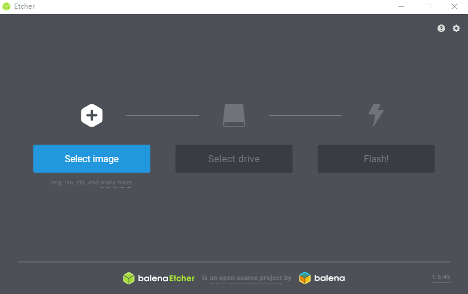
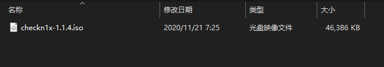
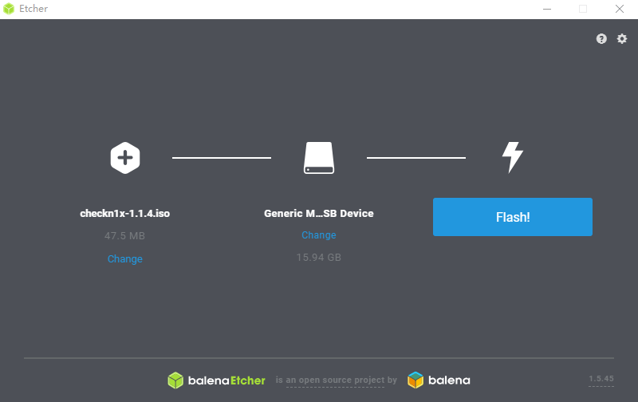
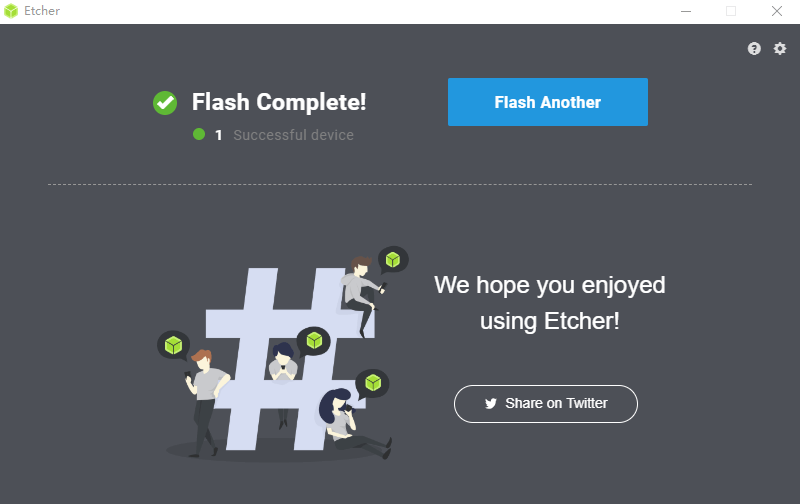
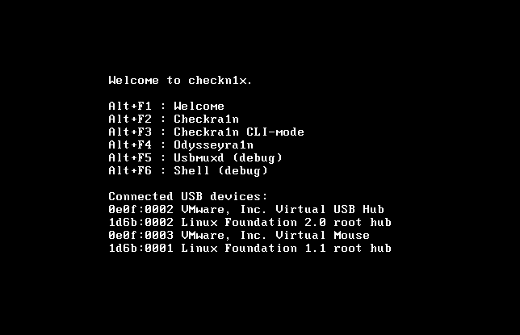
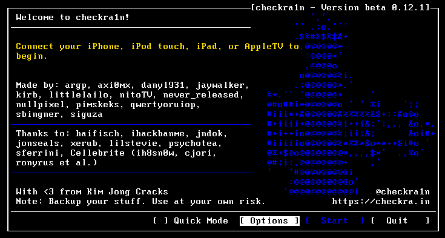
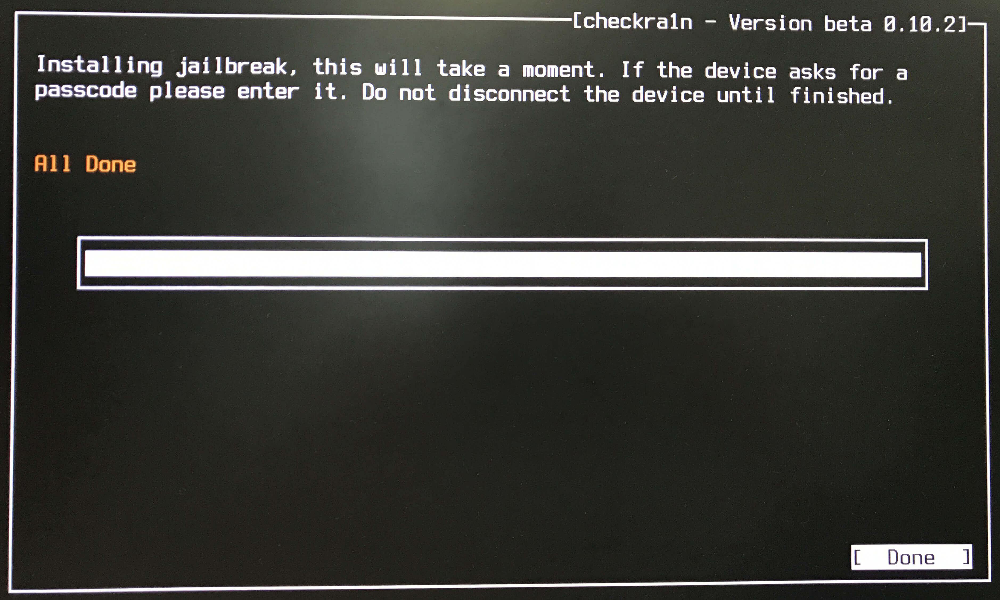

# 超简易checkn1x越狱

## 前言

CheckRa1n 越狱工具需要在 macOS 系统上进行安装，但借助民间大佬做的**checkn1x.iso**镜像文件即可轻松在Windows电脑完成越狱。

----

## **准备工作：**

| 工具                 | 下载地址                                                  |
| -------------------- | --------------------------------------------------------- |
| BalenaEtcher刻录工具 | [官网](https://www.balena.io/etcher/)                     |
| Checkn1x.iso镜像文件 | [点我下载密码1111](https://l1nsn0w.lanzoui.com/b010pts1a) |

| 一个大于1G的U盘    | 一条正常的充电线或数据线 |
| ------------------ | ------------------------ |
| 一台能用的电脑**** | **一台iPhone**           |

准备上述材料后即准备工作结束。

---------

## 制作步骤：

- 打开**BalenaEtcher刻录工具**（注意不要把刻录工具放在中文路径，如果不懂就直接放到桌面）

  

- 从左往右点击第一个选项（Select image)

  选择刚才下载**checkn1x.iso**镜像文件并打开

- 插入U盘（注意：该步骤会清空当前 U  盘上储存的所有数据，请务必提请备份好个人数据）

- 最后一步，从左往右点击第三个按钮（Flash）

- 等待刻录成功

- 到这了则表示已经制作成功了？？？

- 重新插拔U盘，此时电脑可能会提示格式化，这里不需要管，直接重启电脑即可

----

## 启动越狱工具：

重启电脑，进入 BIOS 模式并选择以 U 盘启动，使用数据线将 iPhone 连接至电脑

（不同型号电脑、主板进入 BIOS 方法不同，以下提供部分配置参考）

在Welcome to checkn1x 界面按组合键 Alt+F2 进入 Checkra1n（使用笔记本自带的键盘则是先按住 Fn+Alt 后再按 F2）；

## 开始越狱

- 使用键盘方向键选择右下角“Start”后按回车开始；

  

- 注意：如果提示“Sorry,iPhone (5s-X) is supported,but iOS is not."导致“Start”按钮无法选取，请进入左侧“Options”选项，然后开启“Allow untested iOS/ iPadOS/tvOS versions”项，然后返回即可选取“Start”。

- 使用键盘方向键选择右下角“Start”后按回车，根据屏幕提示将设备进入 DFU 模式；

  

- 进入 DFU 模式后自动执行越狱步骤，无需其他操作；

  

- 越狱完成后，Checkra1n 会提示“All Done”，如果越狱失败请再尝试几次；

  

------

## 越狱完成：

- 此时 iPhone 桌面会有 checkra1n 图标生成，打开桌面的 checkra1n，点击 Cydia 并安装；

- 成功安装 Cydia 后本次越狱完成；
- 重启电脑，断开数据线、U 盘。

---

## 补充：

按照以上方式越狱后，如果重启 iPhone 越狱环境将会失效，需要按照以上步骤重新越狱才能恢复。
