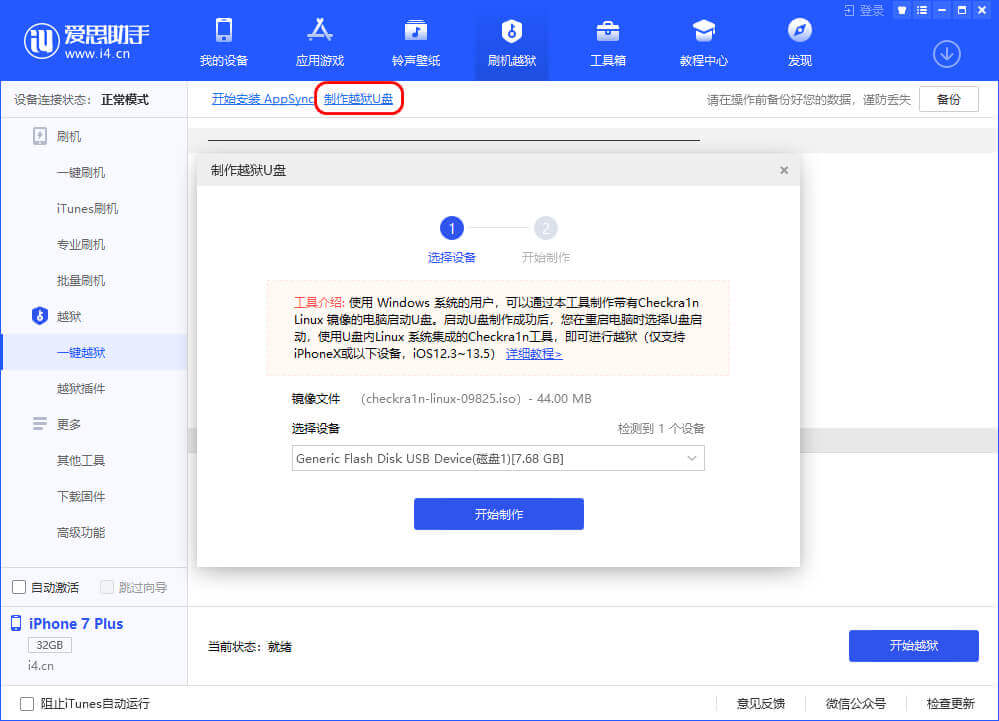
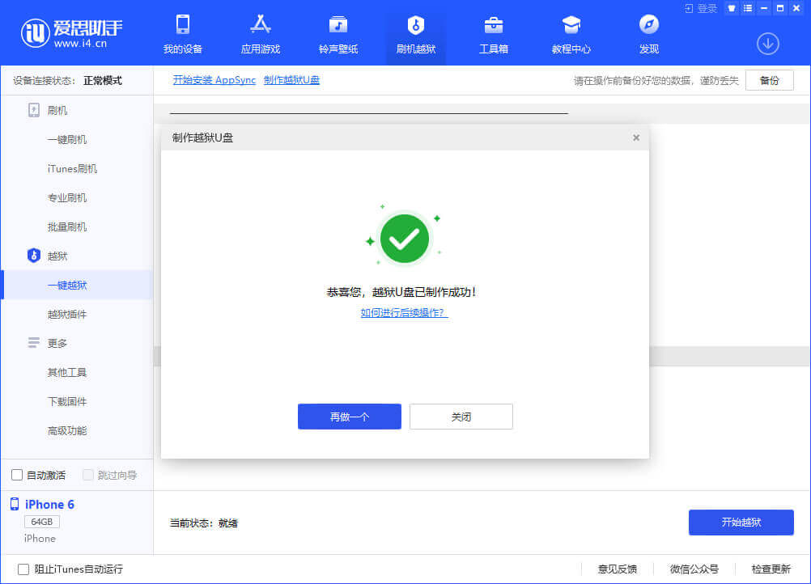
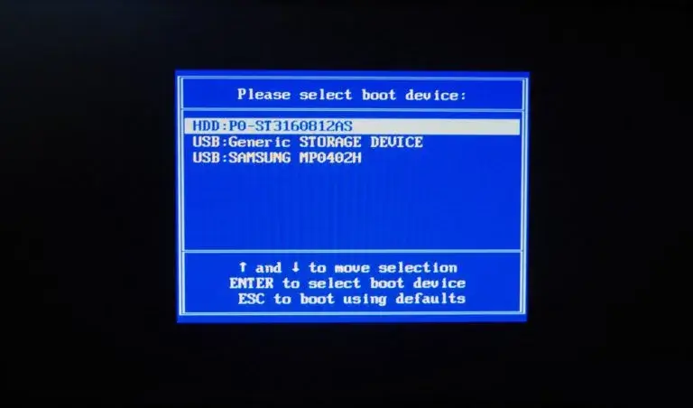
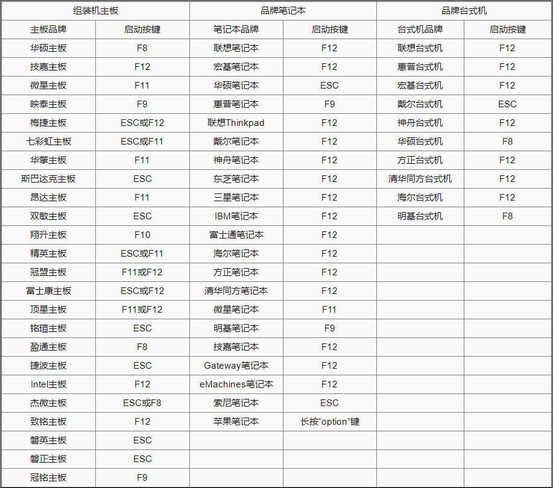
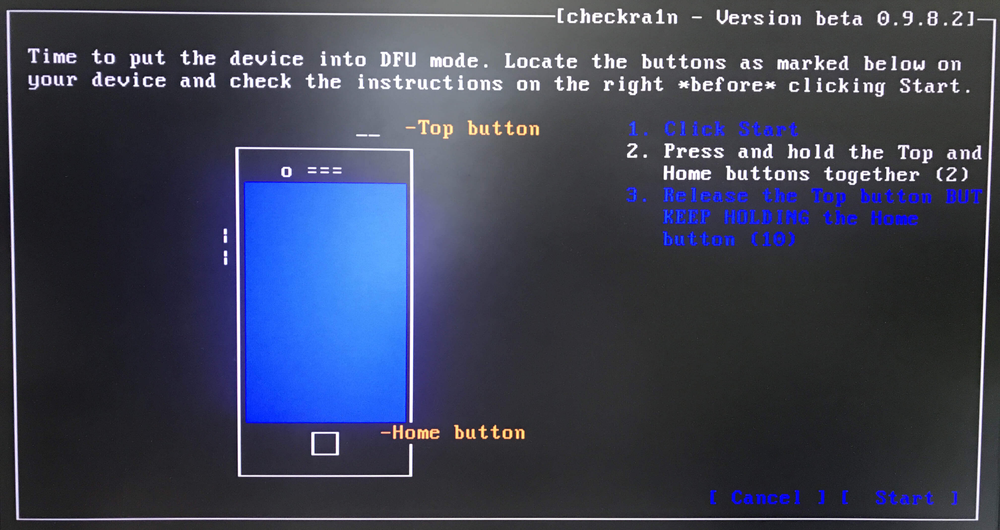
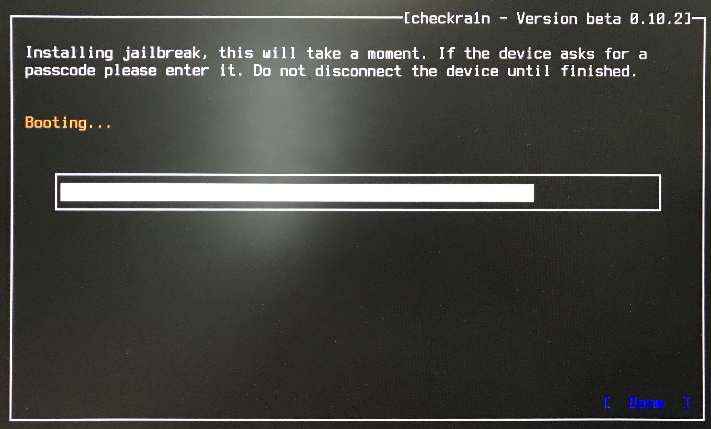
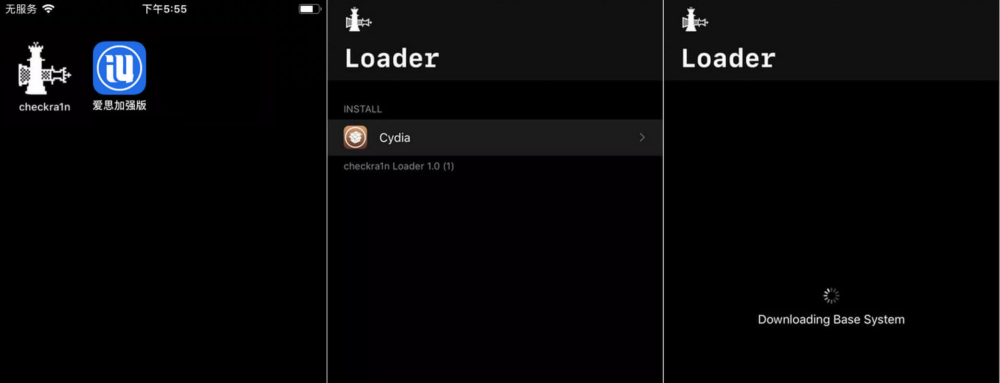

# 使用爱思助手制作越狱U盘

## 前言

CheckRa1n 越狱工具需要在 macOS 系统上进行安装，借助电脑端爱思助手制作越狱 U 盘后，即可在 Windows 电脑上使用 CheckRa1n 进行越狱。

支持设备：iPhone 5S - iPhone X

兼容系统：iOS 12.3 及以上

## **越狱 U 盘制作步骤**

准备好一个 1GB 以上的 U 盘，然后将 U 盘连接至电脑，打开电脑端爱思助手，在“刷机越狱 - 一键越狱”中点击“制作越狱 U  盘”，此时会弹出功能说明并显示已插入的 U 盘，选择用于制作的 U 盘后点击“开始制作”按钮。注意，该步骤会清空当前 U  盘上储存的所有数据，请务必提请备份好个人数据；

随后，爱思助手会自动制作越狱 U 盘，制作完成后点击提示框的“关闭”按钮即可。

## **使用 U 盘越狱步骤

重启电脑，进入 BIOS 模式并选择以 U 盘启动（这里选择 Generic Flash Disk），使用数据线将 iPhone 连接至电脑；

（不同型号电脑、主板进入 BIOS 方法不同，以下提供部分配置参考）

在Welcome to checkn1x 界面按组合键 Alt+F2 进入 Checkra1n（使用笔记本自带的键盘则是先按住 Fn+Alt 后再按 F2）；

使用键盘方向键选择右下角“Start”后按回车开始；

注意：如果提示“Sorry,iPhone (5s-X) is supported,but iOS is not."导致“Start”按钮无法选取，请进入左侧“Options”选项，然后开启“Allow untested iOS/ iPadOS/tvOS versions”项，然后返回即可选取“Start”。

使用键盘方向键选择右下角“Start”后按回车，根据屏幕提示将设备进入 DFU 模式；

进入 DFU 模式后自动执行越狱步骤，无需其他操作；

越狱完成后，Checkra1n 会提示“All Done”，如果越狱失败请再尝试几次；

此时 iPhone 桌面会有 checkra1n 图标生成，打开桌面的 checkra1n，点击 Cydia 并安装；

成功安装 Cydia 后本次越狱完成；

--------------------

重启电脑，断开数据线、U 盘。

按照以上方式越狱后，如果重启 iPhone 越狱环境将会失效，需要按照以上步骤重新越狱才能恢复。
