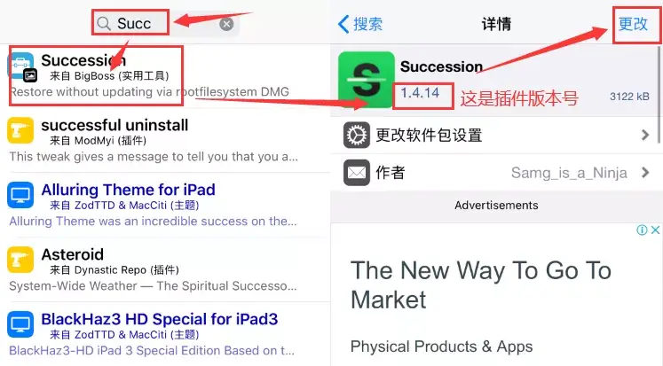
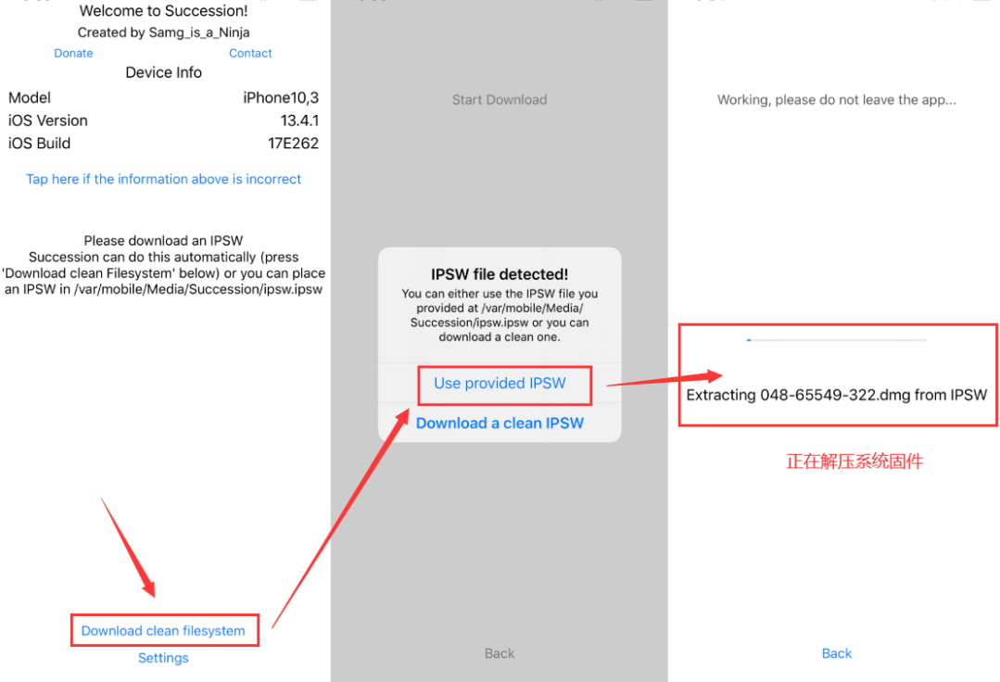
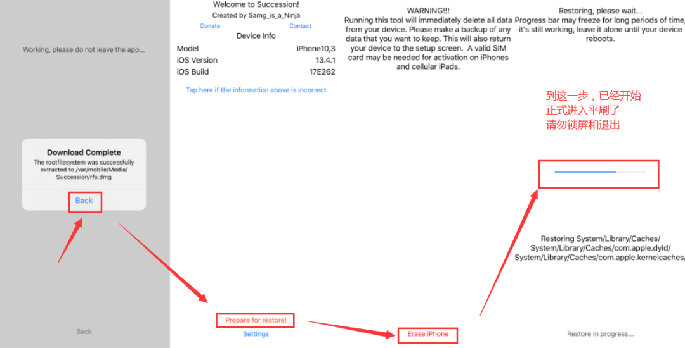

# iOS13.0至13.6Succession平刷教程

## Succession刷机简介：

众所周知 iOS 一旦关闭系统验证，意味着不能正常刷机对当前系统平刷，而这款工具则可以解决这个难题，而越狱后设备，就可以利用 Succession 插件实现平刷了，这款插件它不依赖SHSH，也不依赖SEP，只需要你当前系统越狱，就能对当前系统平刷，但它不能降级和升级！！！

### 关于 Succession 平刷插件信息：

| 插件     |   Succession    |
| :------- | :-------------: |
| 开发者   | Samg_is_a_Ninja |
| 用途     |  平刷当前系统   |
| 系统支持 | iOS 10 至 13.7  |

---

## 教程开始

本教程为导入固件法,会全部清除掉里面的所有内容，succession平刷的和Un快照+抹除还原差不多一样，但是有些情况下确实还是使用succession较全面。本次平刷在未删除本机任何一个插件直接进行，，建议平刷前***`退出ID`***

---

## 准备工作：

当然，手机应该是已经越狱的才行，先在越狱商店下载插件succession

作者源下载：

https//:samgisaninja.github.io/beta

自带源下载：

检查一下BigBOSS源是否空白，如果空白请「科学上网」刷新，检查有插件

再去搜索：Succession并下载

----

## 方法一

### 下载固件

**下载你手机系统版本的固件（注意别下载错了）。**

下载系统固件：可以在线下载或从爱思助手下载然后导入，从爱思助手导入则需要事先安装afc2补丁下载好导入到手机/var/mobile/Media/Succession目录下（注意给固件改名为ipsw.ipsw）。如果没有Succession这个目录就在/var/mobile/Media 下新建一个文件夹（注意大小写）

### 系统固件放入手机：

- 爱思助手下载完固件，右上角下载
- 选择固件，右上角打开文件夹
- 然后爱思助手-我的设备-文件管理
- 找到Succession文件夹，把刚下载固件拉进去
- 然后把固件改名为：ipsw.ipsw

## 开始平刷：

- 手机桌面打开Succession
- 选择「Download clean filesystem」
- 选择「Use开头」，正在解压耐心等待几秒
- 
- 解压完成后，选择 Back 按钮

- 再选择「Prepare for restore」
- 再点击「Erase iPhone」
- 这样就开始准备了
- 数据导入完成，Succession会闪退
- 然后等待几秒钟，手机会自动进入刷机模式
- 注意平刷途中不能息屏和退出
- 

等了很久，还是卡主了，你可以强制重启手机!

平刷完成后，会进入引导激活界面，你就跟着提示操作就行，很简单，这样就能恢复干净的系统了。

##                                        方法二

**
1.打开succession**

**2.点击Download clean filesytem**

**3.点击Start Download（在线下载）**

**4.等进度条走完 点击back**

**5.然后点击红字Prepare for restore！**

**6.点击Erase iphone**

----

**注意  1.** 国行机器可能会出现没办法下载，原因是succession没获得联网权限，需要在Cydia搜索下载“连个锤子”修复一下

​     **2.** 安全起见打开飞行模式连接wifi，防止刷机过程中有电话。

​     **3.** A12以下（包含A12）可以正常使用，succession平刷类似dfu刷机（黑解机不要用）

------

iOS13.3平刷后通用软件更新显示无法检查更新**BUG**

  **解决办法**

1.平刷后再次安装un4.3.1打开Restore RootFS清除越狱状态。

2.平刷前手机关机重新启动 打开un4.3.1激活越狱前 记得关闭Disable Updates选项  再在激活越狱环境。步骤还是上面的1-6

---------

教程完结！！！
