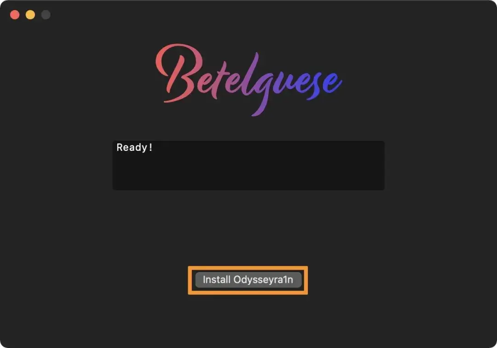
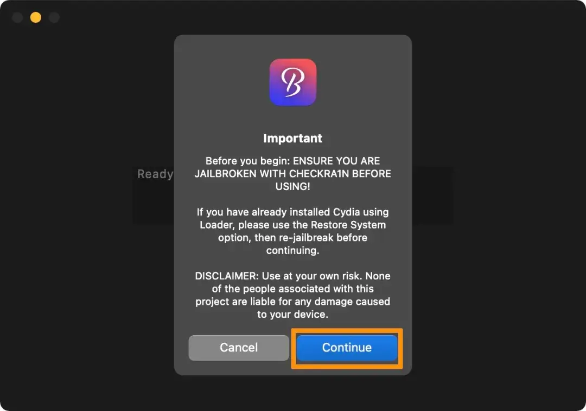
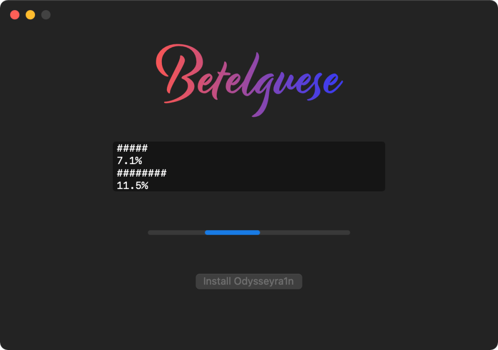
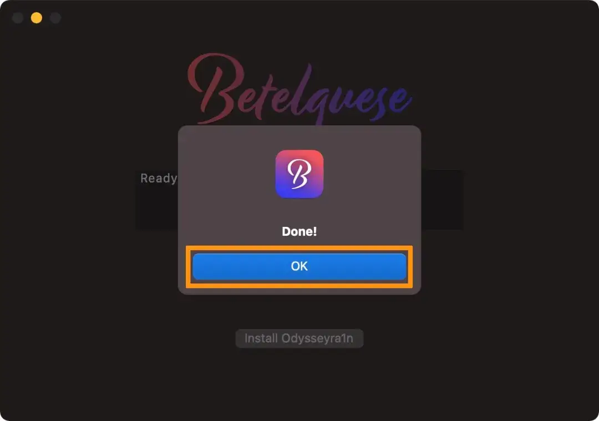
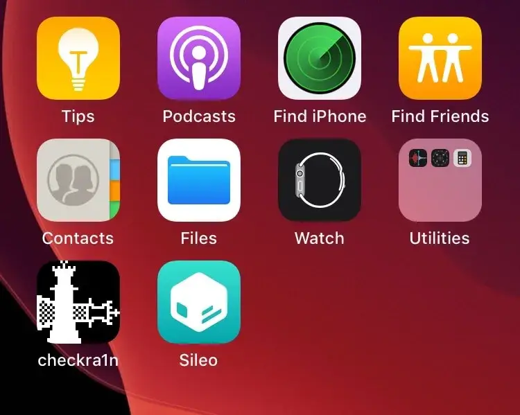

# Odysseyra1n图形化安装工具Betelguese

## **Betelguese 与 Odysseyra1n**

Odysseyra1n 是一个越狱安装脚本工具，通过执行它会把 checkra1n 越狱环境转变为 Odyssey 越狱环境，这意味着你的设备将使用 Procursus 引导程序，其中 Sileo 作为默认程序包管理器，而 libhooker 作为调整注入方法。这些将替换 Cydia 和 Cydia Substrate 进行调整注入以及处理越狱调整的过程。

安装 Odysseyra1n 引导程序将删除 checkra1n 越狱默认安装的 Cydia 程序包管理器，并用与 Odyssey 越狱相关的那些默认的引导程序依赖项替换了一些越狱的默认引导程序依赖项，因此也称为 Odysseyra1n。

## 下载Betelgeuese

Betelguese 安装 Odysseyra1n 的过程十分简单。可以使用两种安装方法，如果你使用的是Brew，则可以简单地通过终端运行 brew install Betelguese 命令。如果不希望命令模式，只需转到 GitHub 官方页面即可获得下载链接。

https://github.com/23Aaron/Betelguese/releases

## 使用Betelgeuese

**注意**：如果你已经通过 checkra1 n越狱并安装了 Cydia，则需要使用 checkra1n Loader 应用程序的「Restore System」功能来删除现有的越狱。

1. 启动 Betelguese 应用。单击「install Odysseyra1n」按钮。

   

2. Betelguese 应用会提示警告，在安装 Odysseyra1n 之前，需要通过 checkra1n Loader 应用程序执行还原系统。如果你跳过步骤 1-2，请立即执行。如果你已执行步骤 1-2，请单击蓝色的「Continue」按钮继续进行。

   

3. Betelguese 将开始在你的设备上安装 Odysseyra1n 的过程。此过程大约需要一到两分钟时间。

   

4. 完成后，只需单击蓝色的「OK」确定按钮

   

5. 现在查看你的 iPhone 或 iPad，那么应该在主屏幕上看到 Sileo。

   

开始享受sileo吧