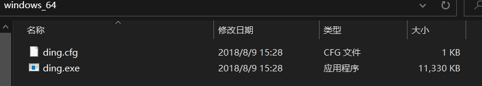
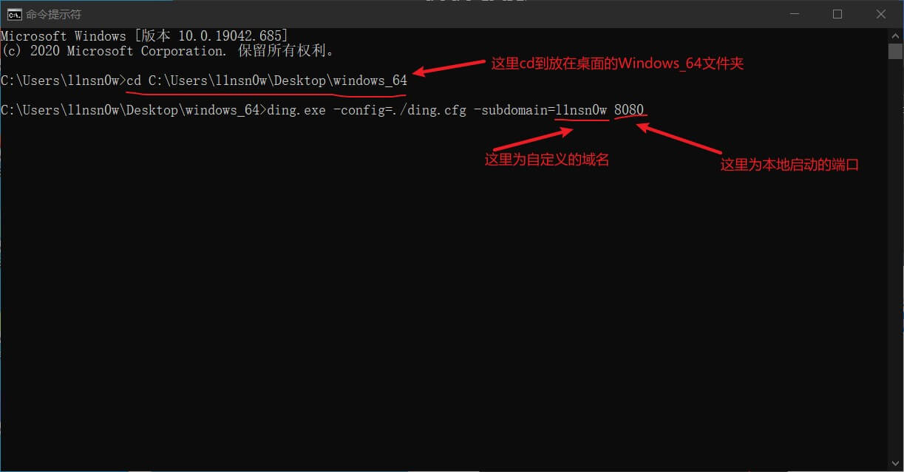
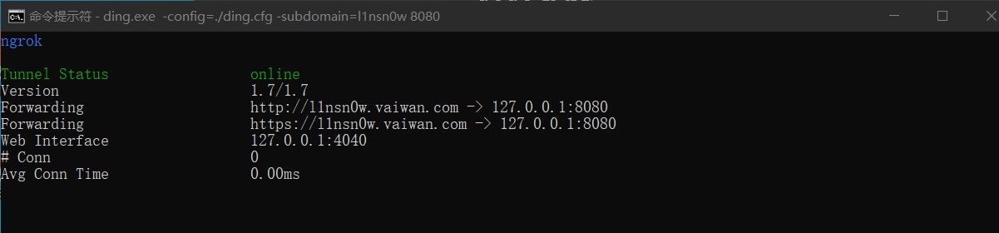
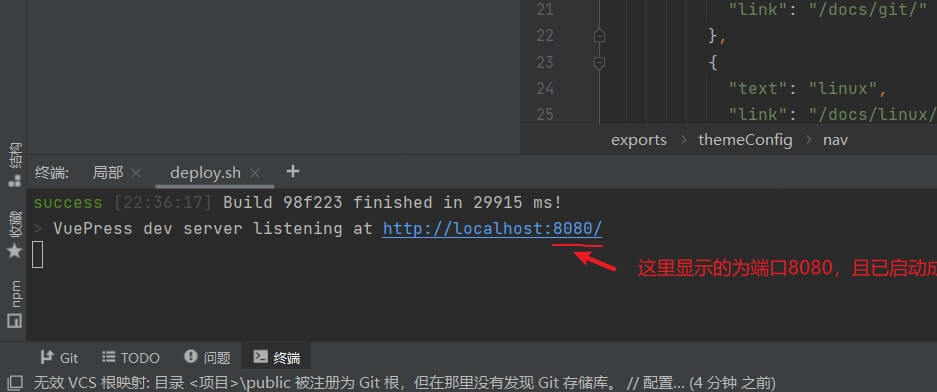
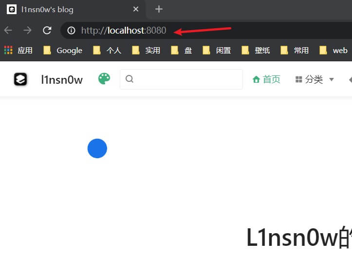
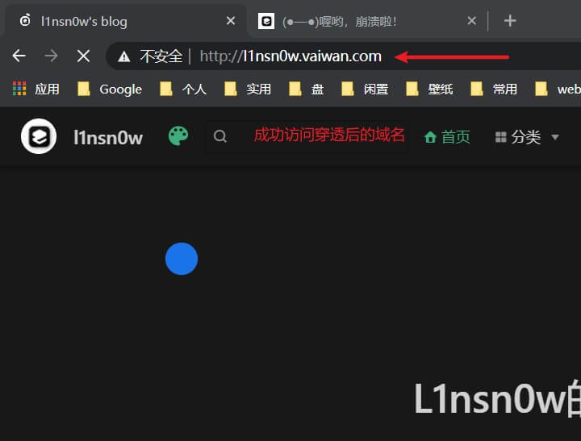

# 带你玩转内网穿透

## 前言：

内网穿透,又叫NAT穿透，是计算机用语，翻译过来就是 你的电脑可以直接被你朋友访问。 通常我们的电脑是无法自己被访问的。因为我们的电脑缺少自己的独立的ip地址。现在ip稀缺，电信运营商已经不会随便分配固定ip给个人。

通常实现内网穿透，是通过路由器上端口映射来实现的。但是路由器通常不是每个人都有权限可以访问和设置,而且可能存在多级路由器较为复杂的网络结构。端口映射也无法实现。

## 钉钉穿透

| [官方文档地址](https://ding-doc.dingtalk.com/doc#/kn6zg7/hb7000) |
| :----------------------------------------------------------- |
| [Github下载地址](https://github.com/open-dingtalk/pierced.git) |

------

### 在Windows使用：

下载完文件后进行解压，找到名为`windows_64`的文件夹, 找到以下文件,本教程将其放在桌面:`C:\Users\l1nsn0w\Desktop\windows_64`

接着打开`cmd`

CMD命令，进入到当前目录，输入如下参数





#### 详细的指令

```shell
cd C:\Users\l1nsn0w\Desktop\windows_64

ding.exe -config=./ding.cfg -subdomain=l1nsn0w 8080
```

输入每行指令并回车




看到以上图片则表示已经穿透成功

执行后的结果

上图表示域名`http://l1nsn0w.vaiwan.com`映射到你本地的`[http://127.0.0.1:8080](http://127.0.0.1:8080/)

------

#### 开启本地端口

这里以我的博客项目为例。




启动成功后，打开浏览器

下图为本地端口预览



下图为穿透后的域名



成功访问域名。