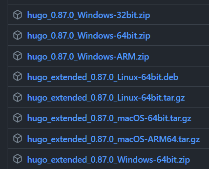
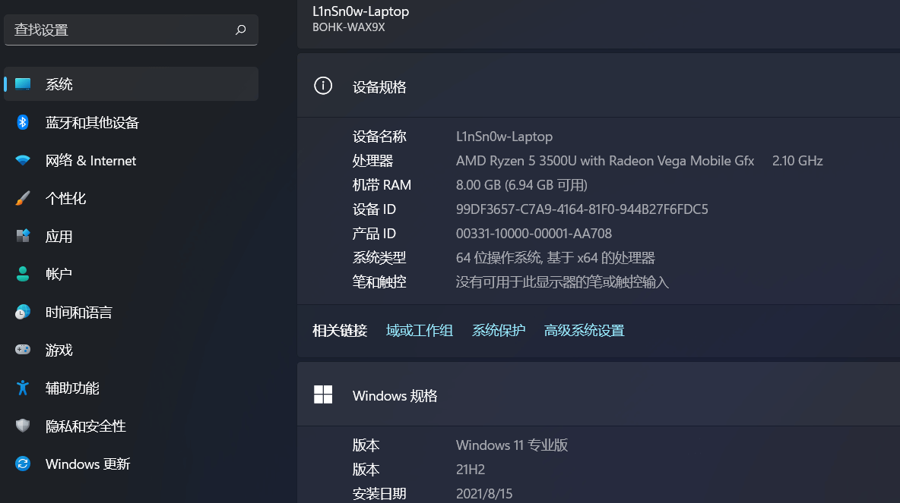
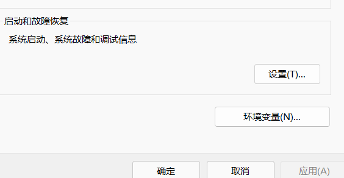
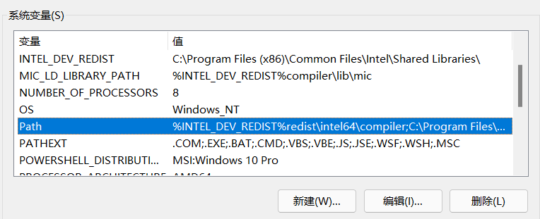
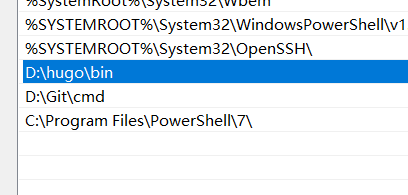

# 在win11下搭建hugo博客环境

## Hugo 简介

搭建个人博客有很多开源的博客框架，我们要介绍的框架叫作`Hugo`。Hugo 是一个基于Go 语言的框架，可以快速方便的创建自己的博客。

Hugo 支持Markdown 语法，我们可以将自己的文章写成Markdown 的格式，放在我们用Hugo 创建的博客系统中，从而展示给他人。

------

## 获取Hugo

> **在GitHub上获取hugo**

> hugo的仓库地址:https://github.com/gohugoio/hugo

------

## 配置hugo

> **以64位hugo0.87版本为例，其他基本都大同小异，或者说是一样的**




1. 下载好的hugo安装包

2. 将其解压出来，会得到一个后缀为exe的可执行文件，但是不要直接刷个双击去运行他（因为他根本运行不了

3. 下面举个栗子，比如我在将这个解压好的hugo.exe文件放在`D:\hugo\bin`目录下

   > 注意：hugo.exe必须放在一个名为`bin`的文件夹下面，至于`bin`文件夹你要放在哪那是你自己的事

4. **在设置-系统-相关链接里找到高级系统设置并打开**

5. **找到环境变量**

   

6. **选择系统变量里的`path`选项**

   

7. 在里面添加hugo.exe存放的所在目录，比如我将其放在了`D:\hugo\bin`目录下，那么就在里面添加上这个路径，如图

   

8. 到这里就算搞定了，在终端里检测一下,输入`hugo version`，查看是否有版本号输出，有的好就算是ok了

```shell
PS C:\Users\l1nsn0w> hugo version  #输入
hugo v0.87.0-B0C541E4+extended windows/amd64 BuildDate=2021-08-03T10:57:28Z VendorInfo=gohugoio #输出结果
```

