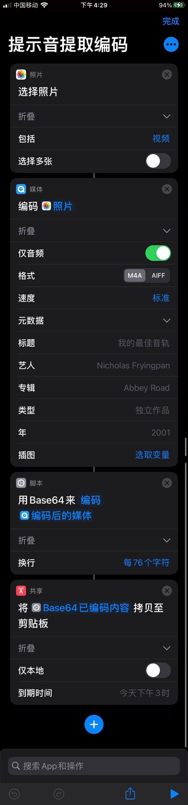
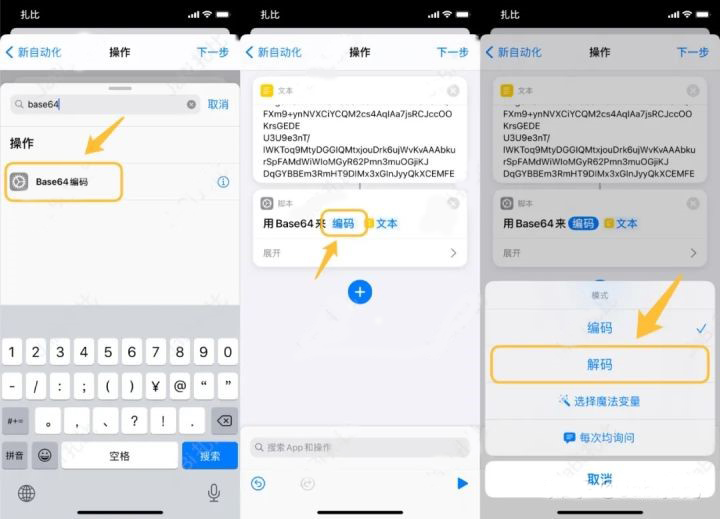
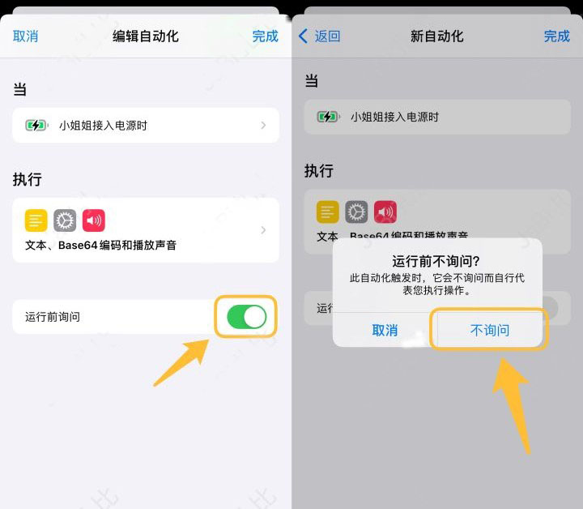
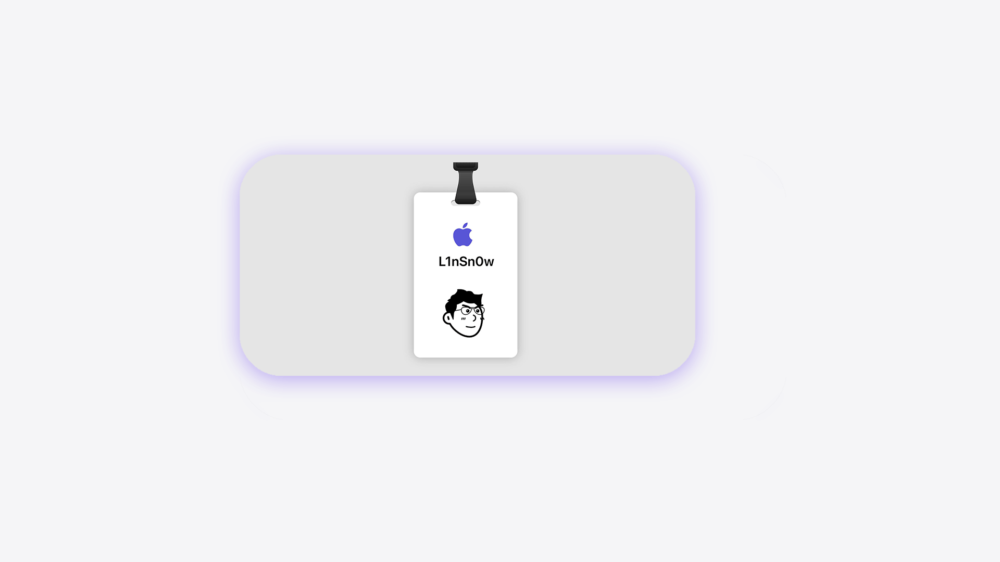
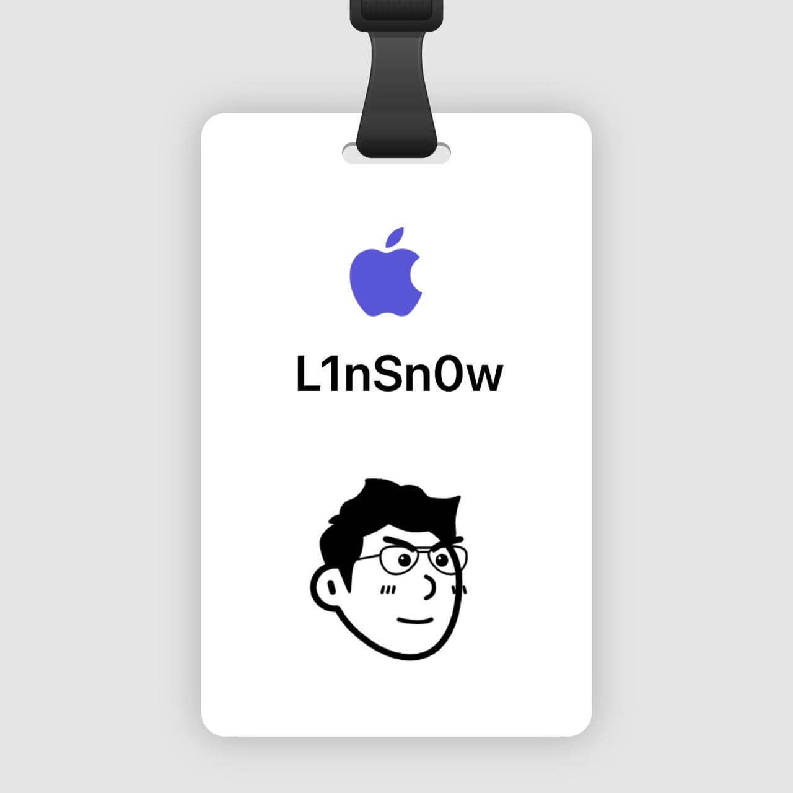
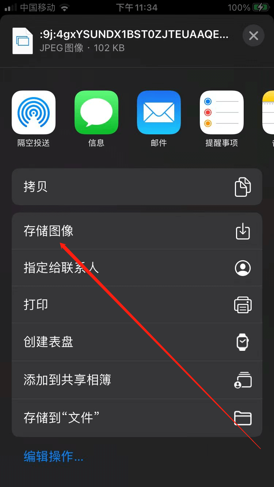
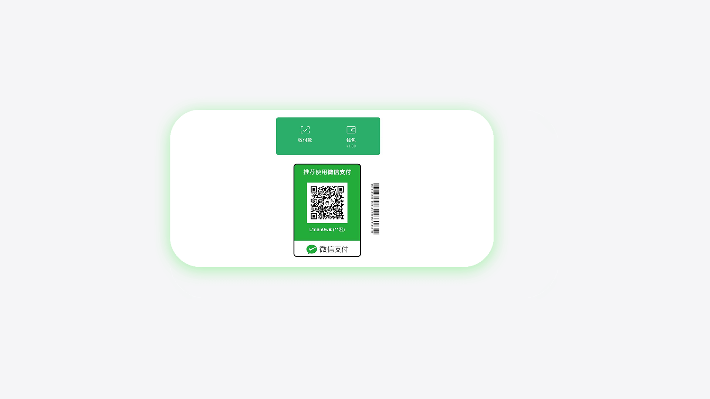
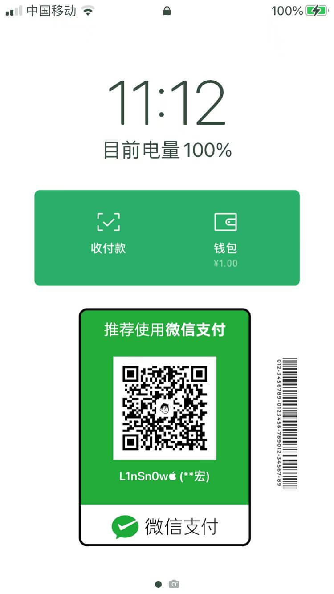
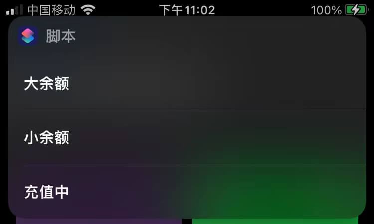

## IOS利用捷径设置充电提示音

### 😀前因

在一次偶然间，我突然发现了手机没了充电提示音，不知道是bug还是，经过一番思索，突然有了这个想法，正好是越狱的iPhone，以为改系统文件可以解决，不过还是不行，突然我就想到了把提示音改成自己喜欢的，一举两得，岂不美哉，利用捷径app就能轻松搞定

### 🧨手机要求

带有快捷指令app和自动化就行了

### 👻正文

#### 创建提取音频编码的指令

创建一个捷径，内容设置成这样子就行

嫌麻烦就用我直接分享的做好的指令，[**快捷指令链接**](getsound.shortcut)，点击后下载下来，然后点击打开即会跳转到捷径app,添加不了的在设置里找到`快捷指令app`，打开`允许不受信任的快捷指令`

#### 获取充电提示音的文本

把提示音以录屏方式保存在相册。首先找到含有自己喜欢的充电提示音视频通过手机录屏的方式或者直接保存到相册中。如果是音频同样可以使用录屏的方式存储到相册中，通过刚才运行刚才制作的指令，运行后会提示选择相册里一个带有想要的充电声音的视频就行了，指令会自动拷贝到粘贴板

#### 创建自动化

1. 打开快捷指令app
2. 选择下面的自动化
3. 点击右上角的+号
4. 选择创建个人自动化
5. 选择充电器
6. 选择已连接，然后下一步
7. 点击`添加操作`
8. 搜索文本并添加文本，文本里粘贴刚才运行指令获得的文本（直接粘贴就行）
9. 再点击加号，搜索base64编码并添加，修改编码为解码
10. 最后点击加号，搜索播放声音并添加就好
11. 然后选择下一步，关掉运行前询问
12. 点击完成就创建好了

------

## 制作一张属于你的Memoji工牌

### 🎉前言

apple store里的员工好像都有一张工牌，刚好扎比大神也做了一个Memoji工牌制作的快捷指令，轻松Get一张属于自己的Memoji工牌。在这里感谢扎比分享的快捷指令。

### 🎈预见效果

### 😬正文

#### 获取捷径

> 这里放出该捷径的文件
>
> [点我下载](memoji.shortcut)

**更详细的获取教程**：

> 点击上面的下载链接，手机会提示下载，同意下载后打开下载的文件，不出意外的话会跳转到捷径app并提示添加此捷径，over🎉,没错，就是这么简单！

------

#### 使用捷径

1. 打开手机的`捷径指令app`，运行下载好的Memoji快捷指令
2. 在弹出来的窗口中选择一张你做好的头像，
3. 然后在提示框中输入你想在工牌上显示的名字，
4. 然后选择你喜欢的颜色，
5. 制作完成后会弹出一个窗口，
6. 选择`存储图像`即可
7. 在相册里就可以看到了。

### 🎈结语

做好了工牌，apple store没你不行哈哈哈哈哈，明天就可以去上班了🐟

------

## Get一张喜人的微信支付壁纸

### 前言

前几天偶然发现一个有趣的捷径，那就是制作一张极具个性化的微信收款码做未锁屏壁纸，当然，这只能在iOS中才能实现，同样要用到捷径app，目前比较新的iOS版本基本上都自带这个app了，如果还没有的话请自行百度解决吧，在正文还没开始之前首先要感谢提供此捷径的作者

### 📢先上效果

### 👌正文教程

#### 获取捷径

> 这里放出该捷径的文件
>
> [点我下载](wepay.shortcut)

**更详细的获取教程**：

> 点击上面的下载链接，手机会提示下载，同意下载后打开下载的文件，不出意外的话会跳转到捷径app并提示添加此捷径，over🎉,没错，就是这么简单！

#### 使用捷径

1. 打开手机的`捷径指令app`，运行下载好的Wepay快捷指令
2. 在弹出来的提示框中选择`大金额`、`小金额`或者`充值中`，
3. 然后选择事先在微信里保存的收款码,
4. 等待自动制作完成即可在相册里看到了。
5. （补充：如何在微信里获取收款码，打开微信，一次点击“支付-收付款-二维码收款-保存收款码”即可）

### 🤑结语

做好了但是谁给我转账啊哈哈哈哈
