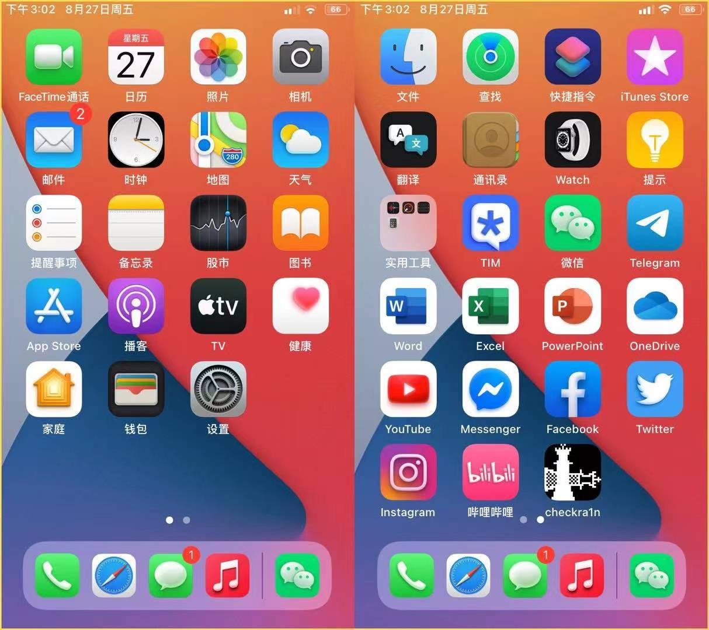
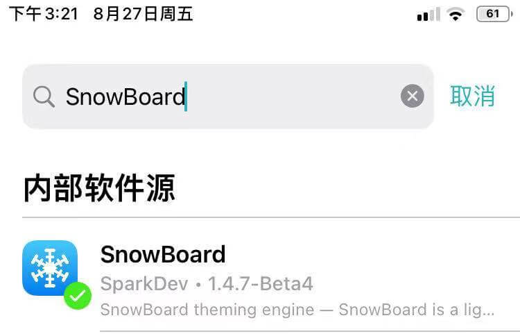
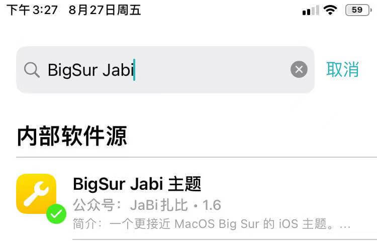
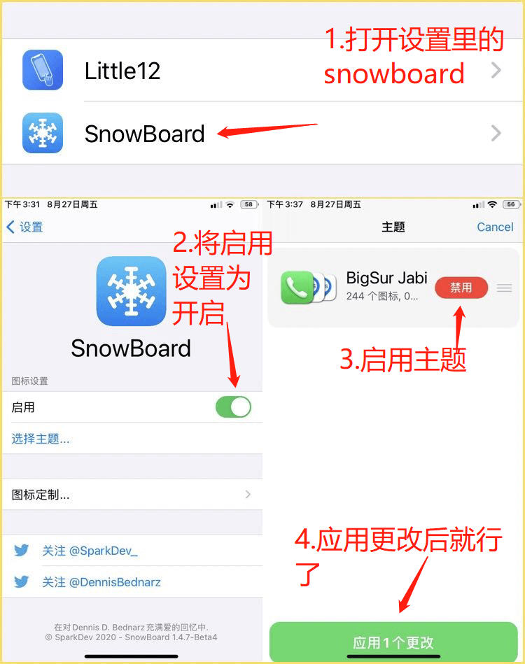

# 当iOS遇上Big Sur

## 效果图

这是效果图，压缩后有点模糊，你忍一下......

## 前言

对于越狱的 iPhone 来说换主题是折腾手机的必经之路，好看的主题会让 iPhone 焕然一新。这是一款由社区玩家Jabi开发的免费主题。采用big sur的图标设计，目前支持两百多款常用软件的图标........本文使用的手机为iOS14.7.1的iPhone6s.并且已经越狱完了（这是一句废话

## 正文

### 前提条件

| 一部越狱好了的手机 | ~~一个可用的越狱商店~~ |
| :----------------: | :--------------------: |
|      ~~耐心~~      |       ~~一双手~~       |

### 准备工作

> 可在本站找到与越狱有关的文章
>
> 先搞懂越狱

### 安装主题平台

#### 简介：

> 什么是主题平台？
>
> > 就是能够让你将主题挂载上去的工具
>
> 目前有哪些主题平台？
>
> > **Anemone3**、**SnowBoard**、**iThemer**、**NeonBoard**
>
> 本文使用的主题平台是SnowBoard（建议都是用这个，老牌稳定

#### 如何安装SnowBoard？

> 添加软件源：https://repo.dynastic.co/ （自带源）
>
> 在sileo/cydia/zebra的搜索栏中搜索`SnowBoard`并下载下来
>
> 
>
> 下载完之后在设置里就能看到snowboard的选项了
>
> 到这里就算是安装了（有手就行

------

### 获取Big Sur主题

> **添加软件源：**https://jabizb.com/repo/
>
> 在sileo/cydia/zebra的搜索栏中搜索`BigSur Jabi`并下载下来
>
> 

### 挂载BigSur主题

> **文字教程**
>
> 1. **在设置里打开刚才安装的snowboard**
> 2. 将插件设置为启用
> 3. 将BigSur Jabi主题设置为启用
>
> **图文教程**
>
> 

------

## 至此完结

不懂评论区里留言，我也不一定会解答（就是这么勇

