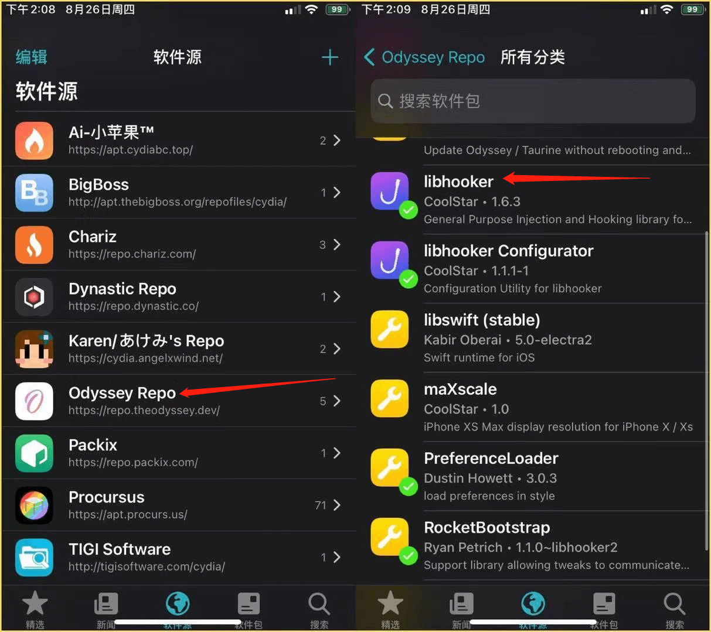
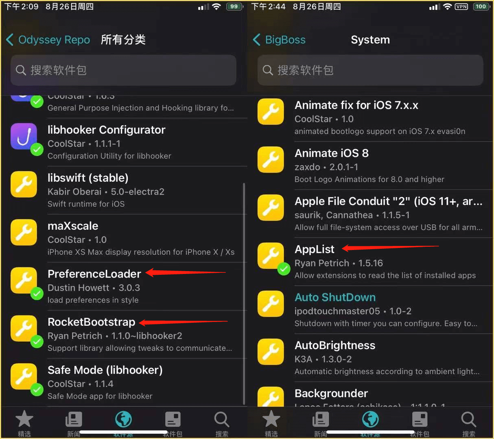

# 越狱后的必备依赖插件

## 前言

以下内容主要面向sileo用户。越狱成功后，越狱环境还缺少有一些重要的依赖插件，没有这些依赖插件，等下会有各种红字与报错，但是安装上依赖就行了。但是，千万不要在依赖还没有安装之前添加一些不好的第三方软件源，否则依赖被劫持就完蛋了....

## 正文

一般先刷新一下软件源列表，以便加载出需要更新的插件，要是刷新不了或着出现软件源里空白的现象就直接科学上网或开个加速器吧，也可以试试开数据来刷新。刷新完之后将能更新的插件全部更新就完事了。但是还有一些依赖插件需要手动安装。

### **安装越狱基板**

> 涉及软件源地址：https://repo.theodyssey.dev/  (自带源)
>
> 插件名称: **libhooker**

### 安装P.R.A三件套

> 涉及软件源地址：https://repo.theodyssey.dev/  (自带源)、
>
> http://apt.thebigboss.org/repofiles/cydia/ （自带源）
>
> 插件名称: **PerferenceLoader**、**RocketBootstrap**、**AppList**

**安装完以上插件之后就算安装完必备依赖插件了**

### 拓展

#### 什么是基板？

> 允许第三方的开发者在系统的方法里打一些运行时补丁，也是绝大部分插件正常工作的基础。

#### 现在有几种基板？

> 目前算是有三个吧
>
> 第一个是substrate，一个是substitute，还有一个libhooker
>
> 其中substrate是大胡子的，也就是最老的那个，但是容易被一些app检测到
>
> substitute是coolstar团队的，相对于substrate封号几率低点（部分插件可能不兼容这个基板）但是这个是大趋势
>
> libhooker 也是coolstar的作品，压缩了substitute+substrate+tweakinjecter提高了转换率，并且表示支持：Android、ios、win、Linux、switch

