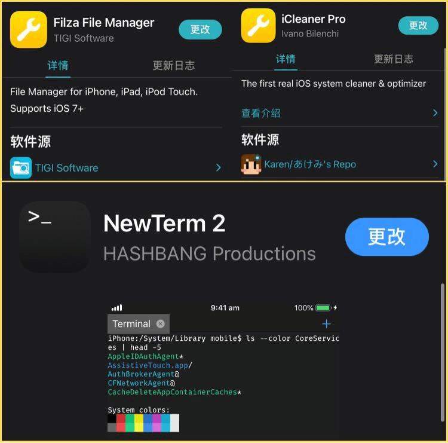
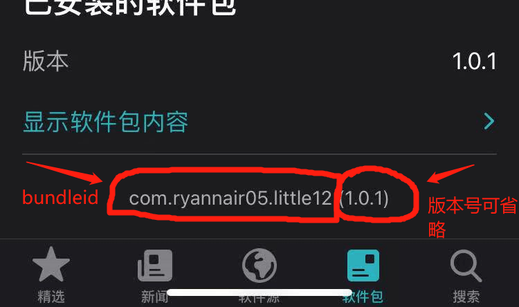

# 越狱常见问题指北手册

### iOS更新屏蔽

Unc0ver越狱自带更新屏蔽

Taurine/Odyssey/Chimera/Electra 越獄成功以後是沒有自帶屏蔽系統更新的，建議去安裝 OTADisabler 來屏蔽更新

> OTADisabler 官方源https://cydia.ichitaso.com/

------

### Dpkg 中断/卸载不掉插件

一般情況都是因为安装了盗版源引起的，建议清除越狱，重新越狱。

------

### Sileo 刷新源报错404/552

一般情況都是网络問題，科学上网即可解決，也可以开加速器或者开数据试试，不過也有可能是作者服务器出錯了（但是可能性不大）。

------

### 逃离Sileo，拥抱Cydia

假如你使用unc0ver或者checkra1n越狱，那么一开始便可直接选择安装cydia

但是如果你是Taurine，Odyssey，Chimera，Odysseyra1n 越狱想用 Cydia 怎么办，在自带的软件源 Procursus 源里安裝 Cydia Installer 即可，但是着并不建议，因为配套使用会更加稳定些，且切换过程可能会出现问题

------

### 人手必备实用工具

**三大使用工具**

> 涉及软件源：
>
> http://tigisoftware.com/cydia/ 
>
> https://cydia.angelxwind.net/ 
>
> https://repo.chariz.com/ 

 

#### Filza File Manager

> 你能想象没有了资源文件管理器的Windows系统吗？
>
> 是的，有了这个宝物，你就能够像安卓或windows一样用文件管理器访问任意目录以及文件，并且支持对多种文件进行修改与编辑，可以说是相当的使用
>
> 这里有个好百度网盘羊毛的技巧：利用这个插件找到百度网盘下载的文件就能随意解压缩而不需要充会员

#### iCleaner Pro

> 越狱界老牌清理工具，还能够给插件排错。
>
> 建议人手一个，用来清理垃圾效果简直不要太好

#### NewTerm 2

> 对小白不是很友好的神器，他就类似于Linux上的shell，能够执行各种命令，并且与Ubuntu的命令基本都是一样的

### NewTerm 2常用命令

在输入大部分命令前需要获取 root 权限，请输入su 或者 su root 密码默认是 alpine（你输入的時候看不见，沒事，直接输入然后回车即可）

如果你想省事那就先输入 sudo 加上你想要的命令，sudo 后面有空格

##### 注销（这个命令好像不用root也能执行）

```shell
 killall SpringBoard/sbreload/uicache -r
```

##### 清理图标缓存（这个命令好像不用root也能执行）

```shell
uicache -a
# 安裝成功插件发现沒有 App 图标出现就可以用这个命令 
```

```shell
uicache -p 你的 app 目录
#这个是单独清除特定 App 的图标缓存
```

##### 软重启

```shell
ldrestart
```

##### 重启手机

```shell
 reboot
```

##### 关机

```shell
 halt
```

##### 重启使用者空间 

```shell
launchctl reboot userspace
```

##### 安全模式

```shell
 killall -SEGV SpringBoard
```

### 进阶命令

> 需要获取 root
>
> 必要是需要获取插件的bundleid

##### 获取插件bundleid

一般划到插件底部就可以看到插件的bundleid



##### 安裝本地 deb 插件

```shell
dpkg -i 你的deb路径
#例如 
#dpkg -i /var/mobile/Documents/aaa.deb
```

##### 在线安裝插件

> 前提是你已经把这个插件的源添加到 源列表上了
>
> 建议安裝插件之前先输入 apt update（类似于刷新软件源）
>
> 这对Linux用户十分友好

```shell
 apt install 插件的bundleid
```

##### 卸载插件

```
 dpkg -r 插件的bundleid 
 or
 apt remove 插件的bundleid
```

##### 更新所有插件

> 建议更新插件之前先输入 apt update（类似于刷新软件源）

然后输入 

```shell
apt upgrade
```

如果让你确认就输入`y`然后回车就行

------

