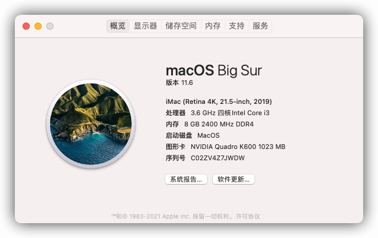
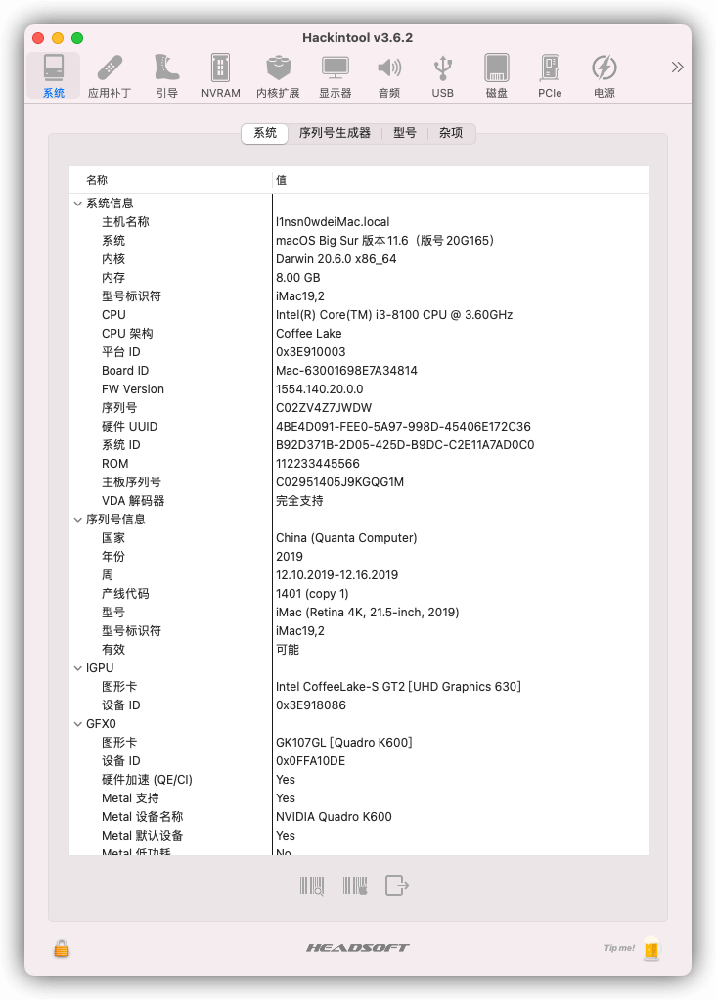
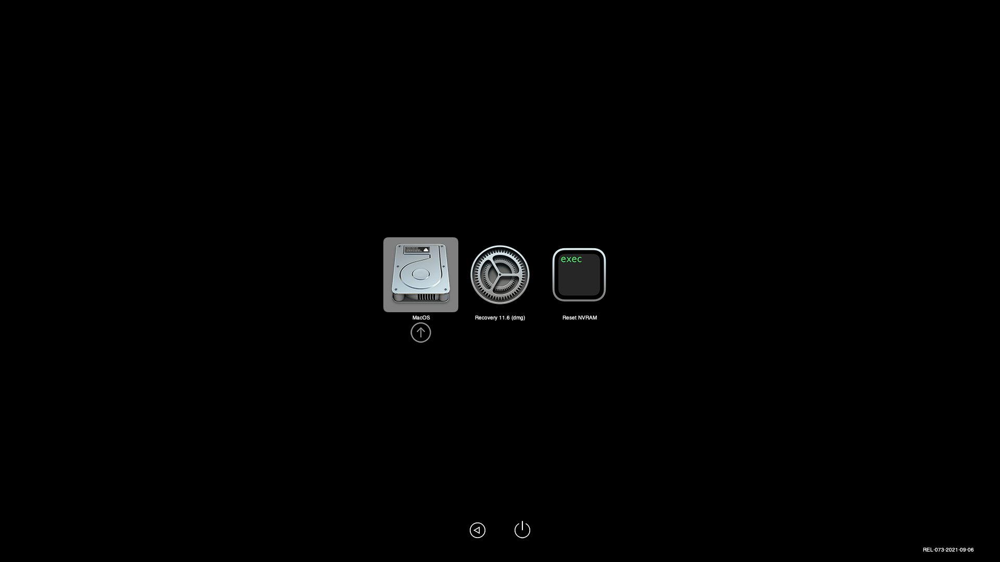
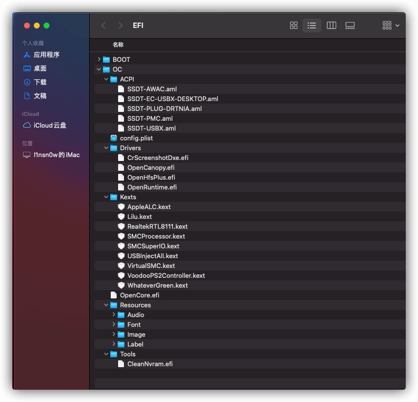

# 我的OpenCore与Hackintosh

## 前言

趁着国庆，我花了一天的时间来学习opencore文件的配置。

在这里十分感谢黑苹果大佬国光的文档及教程，目前配好的EFI可以说是完美黑苹果了。顺便写下这篇文章，

我已经将EFI开源至GitHub，整个EFI全部为2021-10-02最新的驱动及open core版本，opencore不定期会更新一下，可以到GitHub点个star....

## 我的配置

这里简要的写一下

> 主板：华硕PRIME H310M-K
>
> CPU： intel core i3 8100
>
> 硬盘：金士顿sata 128G
>
> 声卡 ：Realtek ALC887
>
> 独立显卡： 英伟达 丽台k600
>
> 核心显卡: UHD630
>
> 网卡： Realtek 8111

## 上几张图片

### macos里的简介

### hackintool概要

### opencore引导界面

### 整个EFI结构

## 项目地址

GitHub：https://github.com/lin-snow/hackintosh-h310-i38100