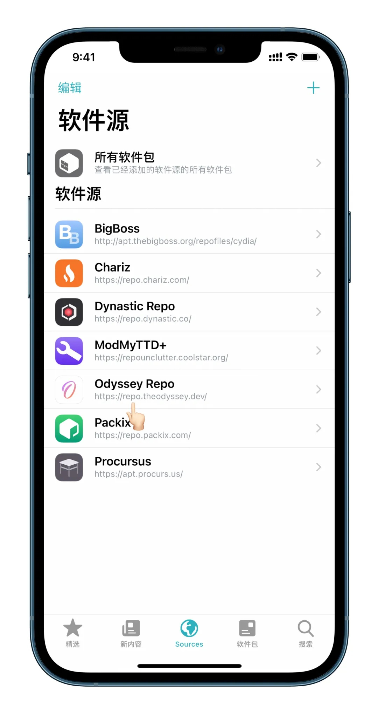
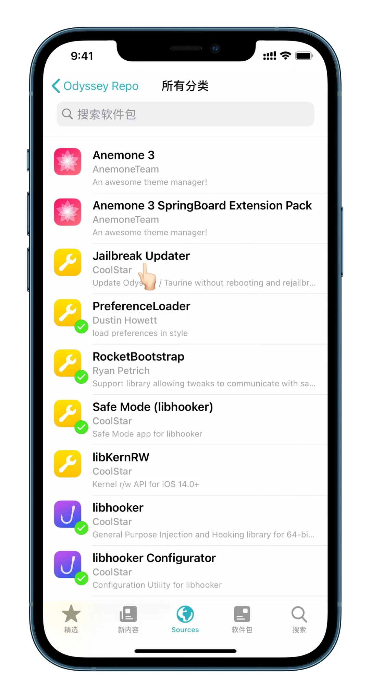

# 一键更新Odyssey/Taurine越狱内核

## Jailebreak Update

Odyssey/Taurine 首席开发者 CoolStar 发布了一款插件，名字为 Jailebreak Update，在 Odyssey Repo 源内可以安装，介绍显示更新 Odyssey/Taurine 无需重启与再次越狱。

该方式仅升级越狱内核，即更新 CoolStar 发布的新版 Odyssey/Taurine 越狱工具的更新日志内容，无法更新越狱工具版本，如果关机重启再次越狱，依然还是旧版越狱工具的内核。

## 安装 Jailbreak Update

安装 Odyssey Repo 源内 Jailbreak Update 插件。

 

## 终端更新

安装终端插件，输入命令进行更新 Odyssey/Taurine 越狱内核。

### 步骤一

安装 Chariz 源内终端插件 NewTerm 2。

### 步骤二

打开终端插件 NewTerm 2 输入以下命令，等待更新完成后重启用户空间即可。

```shell
sudo jbupdate
alpine（密码默认不显示）
```

> 通过 libhooker Configurator 可以查看 Taurine 内核版本，但是打开 Taurine 提示有更新。

## 