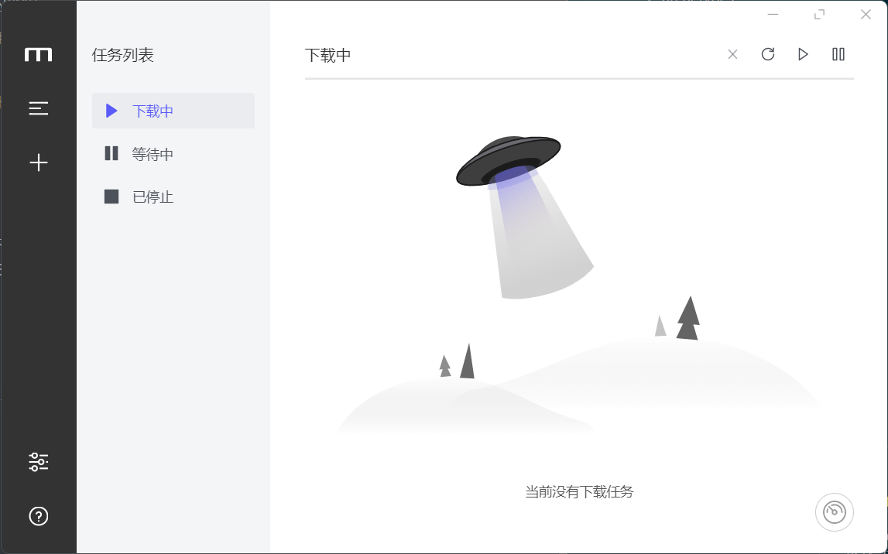
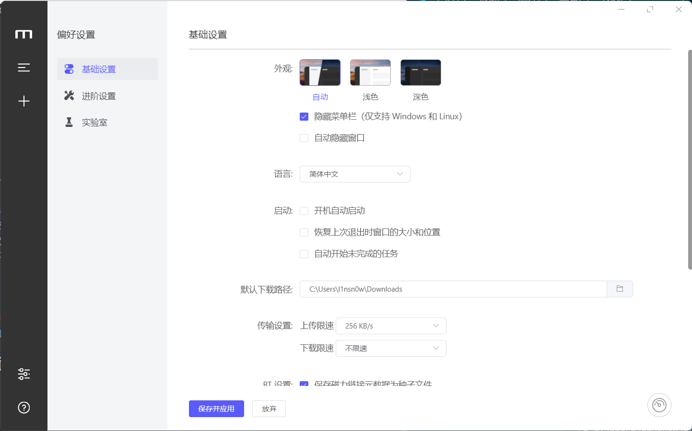
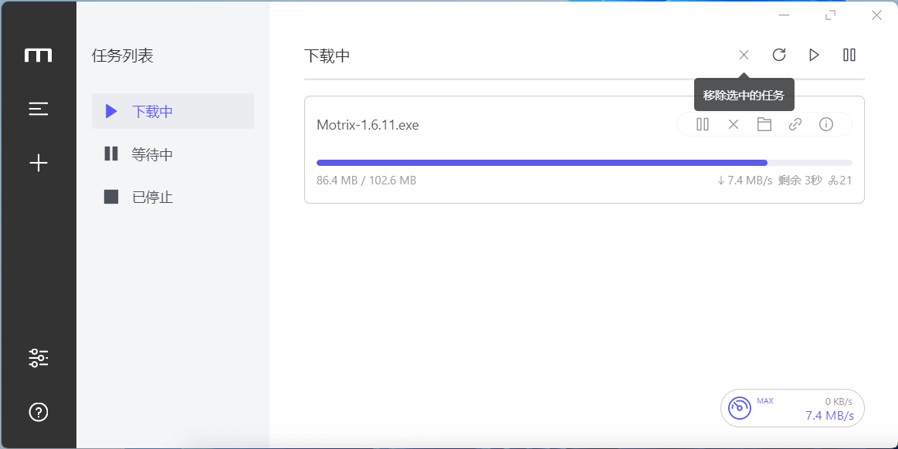

# 我认为的最强开源下载软件之Motrix

## 前言

好的软件不应该被埋没，今天分享一个开源的下载软件--Motrix。说到下载器，你首先想到什么？

某雷？某雷的确很强大，但是由于种种原因，并不可靠；IDM？IDM牛逼是牛逼，可惜不支持BT。

**Motrix**，可以支持 HTTP、FTP、BT、磁力链接、**百度云网盘下载**等等，基本能覆盖所有的资源下载需求。

## Motrix的特点

> -  简单明了的用户界面
> -  支持BT种子磁力链
> -  种子选择性下载
> -  每天自动更新跟踪列表
> -  UPnp = 纳特 - Pmp 端口映射
> -  最多 10 个任务同时下载
> -  单个任务最大支持 64 线程下载
> -  下载进度图形动态显示
> -  模拟用户代理
> -  下载已完成的通知
> -  用于快速操作的居民系统托盘
> -  黑暗模式
> -  删除任务时删除相关文件（可选）
> -  I18n
> - .......

Motrix使用aria2作为内核，下载速度非常快，Motrix也可以接管你的浏览器（需要Chromium内核浏览器）下载，成为你的默认下载器，不用担心下载不了扩展，它的扩展也可以在GitHub上下载到，简直十分的良心。软件代码基于 Electron + Vue + VueX + Element 等技术编写而来，对开发感兴趣的同学可以参考学习一下。

## 跨平台

Motrix支持Windows、Linux和macos。并且跨平台界面统一，在 Windows、[macOS](https://www.iplaysoft.com/os/mac-platform)、[Linux](https://www.iplaysoft.com/os/linux-platform) 三大平台上都有着一致的使用体验。

## 软件界面

**下载界面**

**其他界面**

## 口说无凭

**以下载GitHub上的软件做测试**

以下载GitHub上的Motrix做测试

好家伙，还好我截图快，差点就下载完了

## 软件地址

> 官网网站：[莫特里克斯 (motrix.app)](https://motrix.app/)
>
> GitHub仓库地址：https://github.com/agalwood/Motrix

