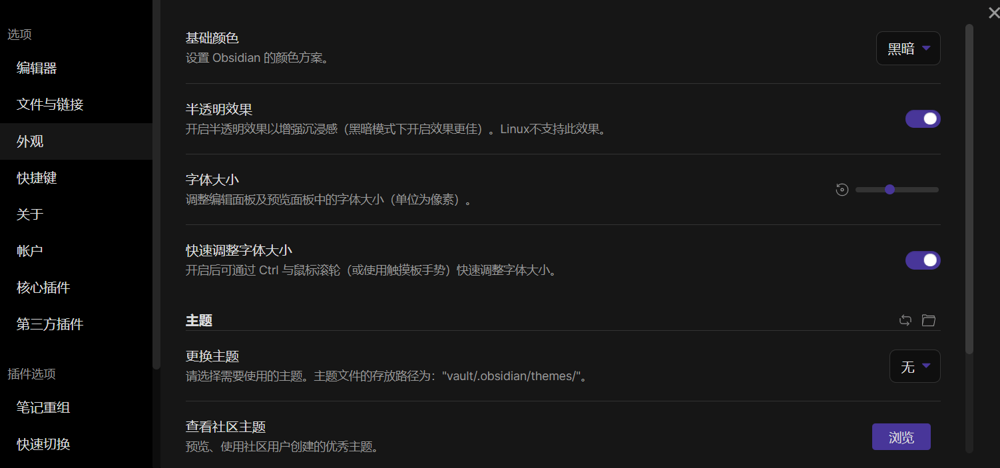
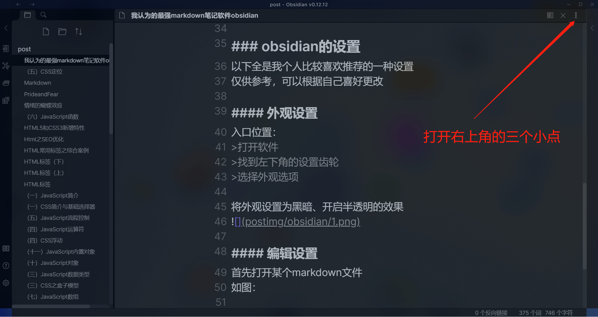
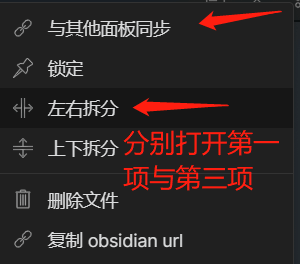
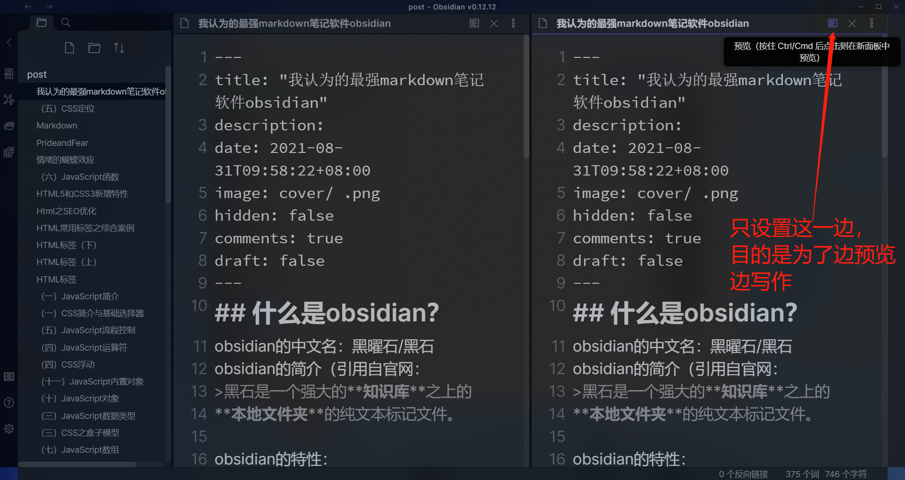
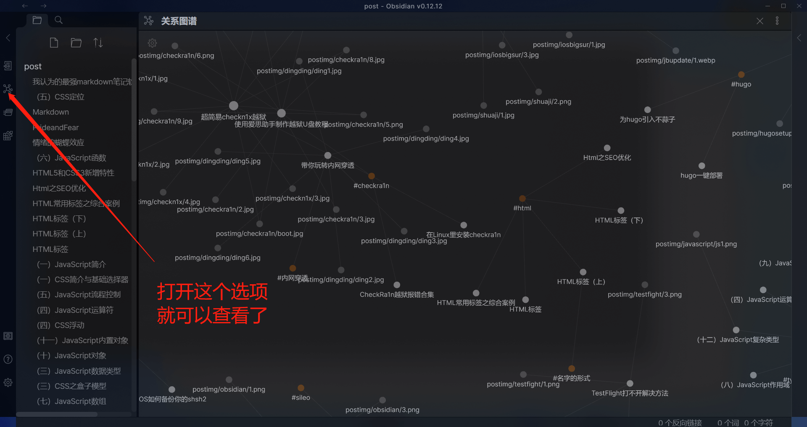

# 我认为的最强markdown笔记软件obsidian

## 什么是obsidian？

obsidian的中文名：黑曜石/黑石
obsidian的简介（引用自官网：
>黑石是一个强大的**知识库**之上的  
**本地文件夹**的纯文本标记文件。

obsidian的特性：
>这是一款支持 Markdown 的本地应用（不同于notion，笔记掌握在自己手里，更安全
>支持全平台的操作系统（包含移动端
>文件夹式管理
>支持各种插件
>支持自定义css
>思维脑图式的笔记管理
>能够记忆上一次编辑
>支持云同步
>个人用户免费
>...

功能多到数不过来了，就简单的列了一些常用的功能
Obsidian生成的文件全是Markdown格式。如果你已经用过markdown语法，那很棒，Obsidian对你来说几乎没有门槛。
##  我的obsidian工作流
**以hugo博客写作为例**
我只需要在终端中用hugo命令创建好markdown文件
并使用的obsidian进行编辑即可

### obsidian的设置
以下全是我个人比较喜欢推荐的一种设置
仅供参考，可以根据自己喜好更改

#### 外观设置
入口位置：
>打开软件
>找到左下角的设置齿轮
>选择外观选项

将外观设置为黑暗、开启半透明的效果

#### 编辑设置
**目的/作用**
>达成边写作边预览的效果
>方便即使纠错
>方便文章排版

首先打开某个markdown文件
如图：
打开软件页面的右上角上的三个点

在弹出的选项页面打开`与其他面板同步`、`左右拆分`

将其中一边设置为预览模式：
可以直接在右上角设置
也可以使用快捷键`ctrl + E`设置

到这里基本上都设置完了

接下来演示一些其他的功能
## 查看关系图谱

其他的一些功能就不展示了

## 软件获取
>**官网地址**：[黑曜石](https://obsidian.md/)
