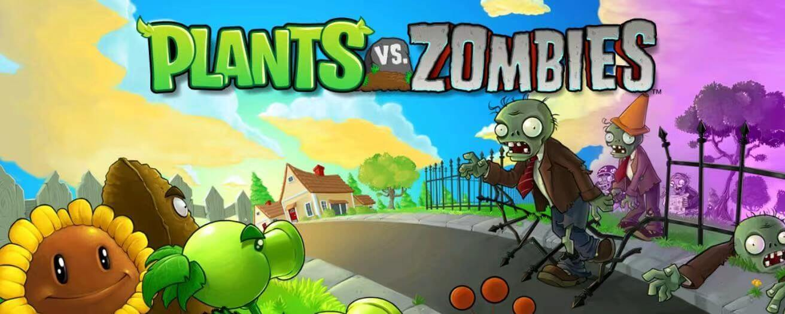
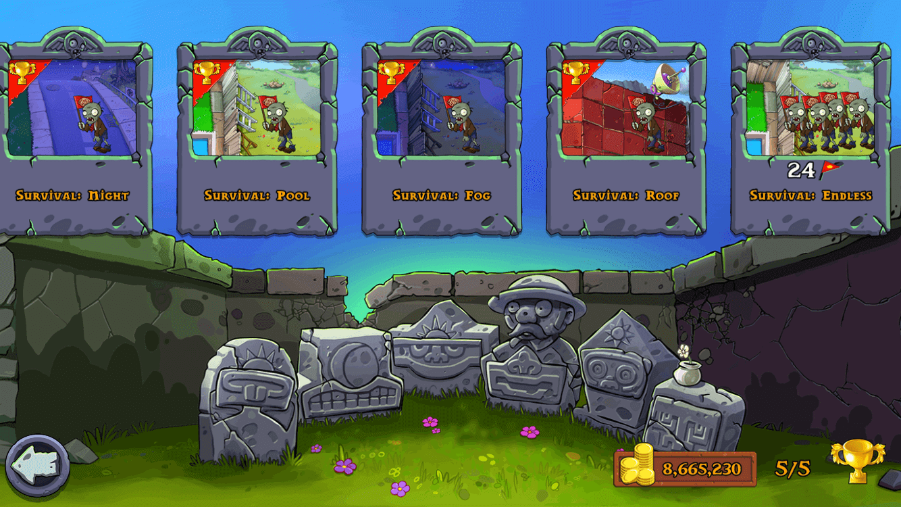
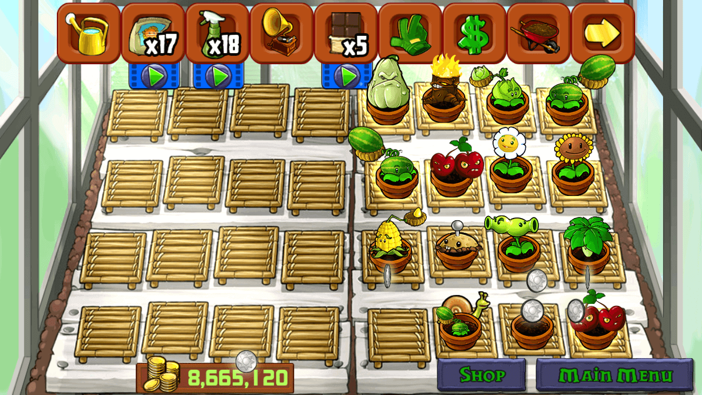

# PvZ巨佬的养老心得分享

### 关于PvZ

中文名称：植物大战僵尸，一款曾经火遍全球的小游戏。在现在用一个词来形容它：“经典”。

### 我的童年与PvZ

童年的我，对植物有着独特的感情，pvz的背景音乐和关卡总是那么恰到好处，真是回味无穷

这游戏很明显已经是历史悠久了，但是在不久的五一假期，我突然想起来了它，本片blog主要写一代pvz，一款老少皆宜的游戏对我这种高玩来说通关简直就是有手就行，但是，它在现代还有什么吸引我的地方吗？有的，那就是它的“无尽模式——泳池无尽”，我把这个关卡当作用来判定玩家的技术的关卡，即使玩了多年pvz的高玩也不一定能坚持的了几关，无尽模式是真的刺激。

### Re：2021从零开始PvZ

支持正版，从我做起！App Store的PvZ依然保持着更新！好家伙！十分良心，冲了。是电脑玩家的话还是从steam下吧！两个还是有点区别的。不过移动版的比较便捷，适合随时随地肝无尽，就很舒服，关键游戏也不吃配置，带上钉子户6s就可以开撸了哈哈哈哈

### 无尽模式

无尽模式可以说是最具有挑战性的关卡了，玩到后期每行都有几只红眼巨人，难度可想而知，对我来说，这或许就是它现在最大的可玩性吧，在贴吧里就可以找到很多的大佬，挑战各种阵型，冲刺一千关。。。

### PvZ的养老模式

通关后该怎么办呢，当然就是打理花园，作为收藏党，不把花园的植物集齐是真难受，每天上线第一件事当然是上奸商的店买买花了，花园可谓是游戏养老的不二之选。
