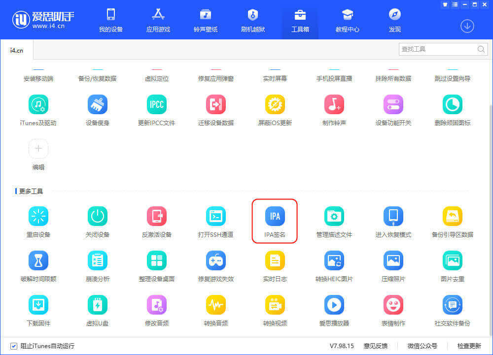
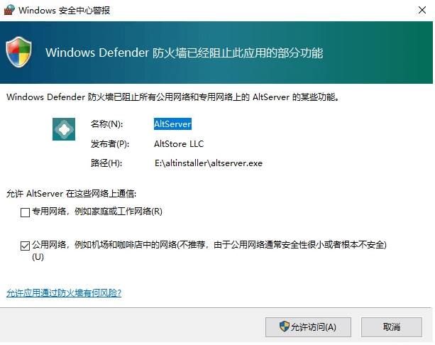
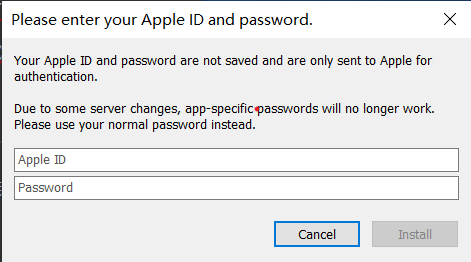
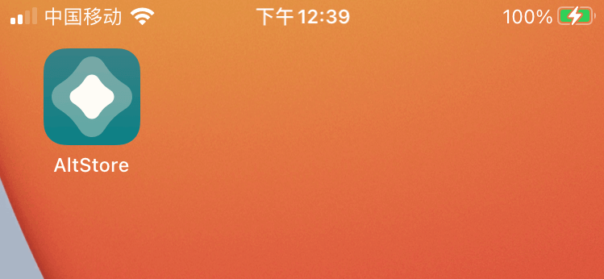
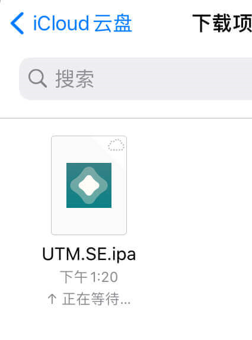
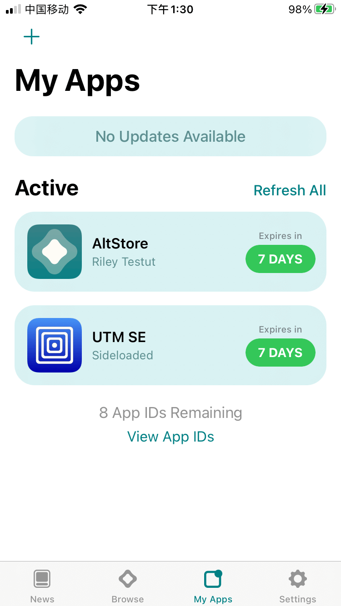
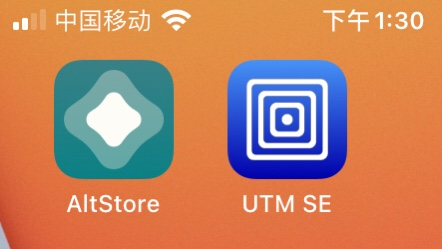

# 签名ipa以在iOS下安装软件

## 前言

iOS或iPadOS安装第三方软件需要对其进行签名才能安装到设备上，但特殊情况如在iOS已经越狱的情况下可通过插件绕过签名直接安装，侧载的方法有很多，大概分为一下两个大的签名方式，但这次写的是关于利用个人免费开发者账号签名并安装到设备上

> 免费开发者账号签名的软件必须每7天重新签名一次，否则会掉签，然后就打不开了
>
> 付费开发者账号可以每1年重新签名一次，这里推荐一个签名网站[isign](http://isign.ren/#/)

以下分别介绍两个软件的签名教程，一个是爱思助手，一个是开源的Altstore，其他的签名软件本文就不讲了，毕竟要用到macos，也不是每个人都有macos使用

> 注：
>
> 爱思助手：适合频繁使用电脑的认识签名，对于小白友好
>
> Alt store：适合需要稳定签名的小伙伴，在iOS14及以上有组件提示日期，能够在链接服务器的条件下在手机完成签名并安装
>
> 总之，最好两者都会，会方便很多

## 正文：

### 爱思助手ipa签名

1.选择“使用 Apple ID 签名 - 添加 Apple ID”，随后输入用于签名的 Apple ID、密码并选择或输入对应设备的设备标识（指签名后 IPA 文件要安装的设备）；

2.检查无误后点击“确定”。建议操作前需要将 iOS 设备连接至爱思助手，并保证可以读出“设备标识”，如果未连接设备，需要手动输入设备标识。Apple ID 添加完成后下方列表就会显示签名信息；

3.之后，添加需要签名的 IPA 文件并勾选 IPA 文件和用于签名的 Apple ID，点击“开始签名”即可，签名成功后就可以通过爱思助手安装该应用了。安装完成后，在 iOS 设备上首次打开前记得去“设置 - 通用 - 描述文件”内信任该应用。

**请务必注意，已签名的 IPA 文件和原文件保存路径可能并不相同，签名后应该点击“打开已签名 IPA 位置”按钮，可用于安装的已签名 IPA 文件都会储存在该目录下，请注意分辨。**

------

### Altstore签名

#### 准备工作：

1.AltStore工具只能在Windows 10系统下使用，其他Windows版本不支持。

2.安装之前：

1. [直接从Apple](https://www.apple.com/itunes/)（**而不是**Microsoft Store）下载最新版本的iTunes 。
2. [直接从Apple](https://support.apple.com/en-us/HT204283)（**而不是**Microsoft Store）下载最新版本的iCloud 。
3. 一个正常的**apple id**

------

#### 正式开始Altstore的安装

1. 安装iTunes以及iCloud，安装完或许会提示重启，重启就完事了

2. 登录iTunes并授权此电脑，iCloud不必登录也行

3. 在官网获取最新版[altstore](https://altstore.io/)

4. 安装altstore并用数据线（充电线）将设备连接到电脑

5. 在开始菜单找到altserver并打开，这是可能会提示防火墙信息，允许就好了

6. 这时解锁你的设备并在设备弹出的窗口中选择信任此电脑

7. 鼠标左键单击任务栏中的altstore小图标，

8. 选择***install AltStore***，再选择你的的设备名称

9. 在弹出来的窗口中输入你的 apple id及密码并点击install

10. 接下来就会看见Installing AltStore to+你的设备名称 … ，代表AltStore正在签名安装中，请耐心等待安装完成，即可将altstore安装到设备

11. 整个安装AltStore进的过程有长有短，在iPhone桌面出现AltStore APP之后，安装过程才算完成，此时先别动，在设备中打开设置-通用-设备管理-选择altstore-信任alt store，如无法信任，请重新安装。

12. 这时即可将要安装的软件安装包导入到手机并使用altstore打开即可在手机完成安装

    

------

### 示例：安装UTM

1. 从[utm官网](https://getutm.app/install/)获取UTM安装包

2. 打开手机中的altstore

3. 点击左上角的+号

4. 选择UTM.ipa安装包安装即可,等待安装完成

5.   

6. 这样就算安装完了

   ------

   

7.  

