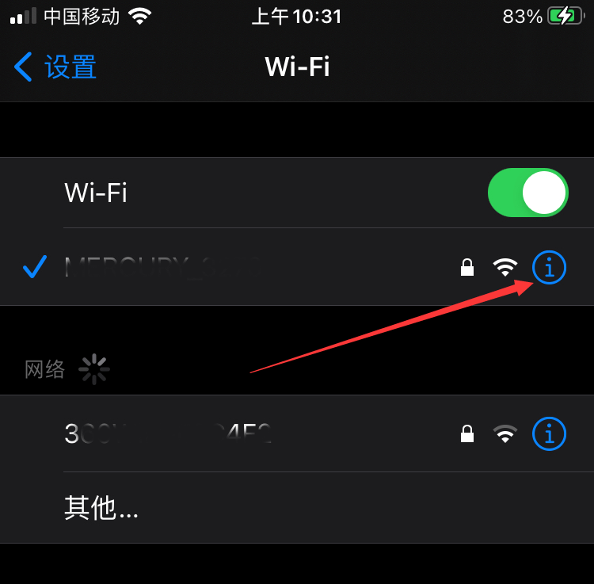
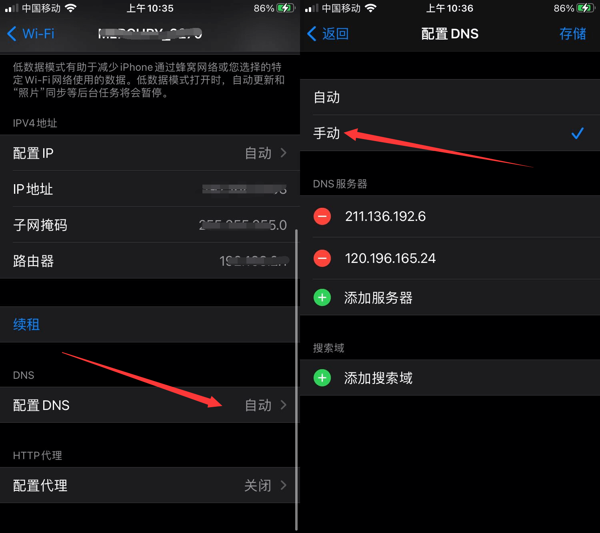
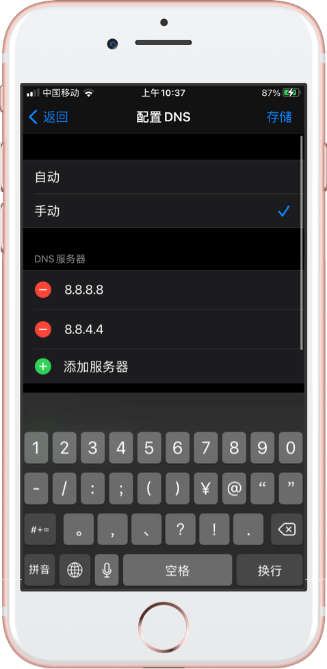

# TestFlight打不开解决方法

## 前因

苹果的 TestFlight 应用属实听奇怪的，又是突然就打不开，导致想下载测试版的应用都下载不了。「无法接入」主要是因为苹果服务器的问题，而要解决这个问题其实非常简单。

## **操作教程**

> 遇到这个问题可以尝试更换网络，但更换网络并不是百分百能解决。

**iPhone 链接上 Wi-Fi 后，进入「设置」-「无线局域网」。点击已经链接 Wi-Fi 的蓝色「i」按钮。**

**点击「配置 DNS」设置项，勾选「手动」。**

**点击「添加服务器」，这里输入8.8.8.8后点击右上角的「存储」按钮。**

**这时候打开 TsetFlight 应用就会发现它可以正常打开使用了。**

如果你担心设置了 DNS 服务器后会影响网速，可以在 TestFlight 下载完应用后把 Wi-Fi 的 DNS 服务改回自动。