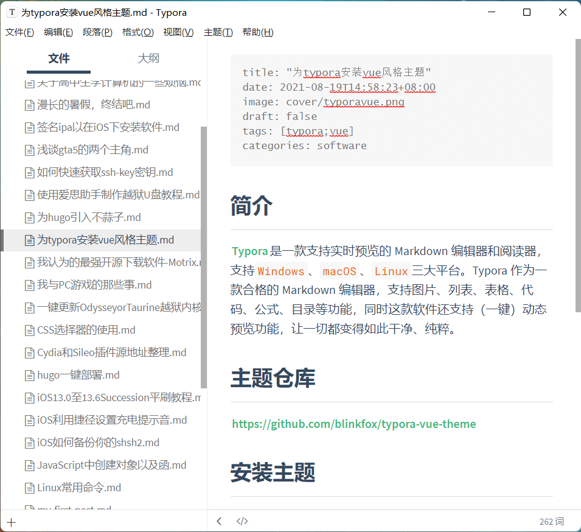

# 为typora安装vue风格主题

## 简介

[Typora](https://www.typora.io/)是一款支持实时预览的 Markdown 编辑器和阅读器，支持`Windows`、`macOS`、`Linux`三大平台。Typora 作为一款合格的 Markdown 编辑器，支持图片、列表、表格、代码、公式、目录等功能，同时这款软件还支持（一键）动态预览功能，让一切都变得如此干净、纯粹。

## 主题仓库

https://github.com/blinkfox/typora-vue-theme

> 在这里十分感谢**blinkfox**大佬开发的主题

## 安装主题

1. 从主题仓库克隆到本地并获取主题中的`vue.css`、`vue-dark.css`文件和包含字体的`vue`文件夹；
2. 打开 Typora，点击“**偏好设置**” => “**打开主题文件夹**”按钮，将弹出 Typora 的主题文件夹；
3. 将下载好的`vue.css`和`vue-dark.css`文件和包含字体的`vue`文件夹放到 Typora 的主题文件夹中；
4. 关闭并重新打开 Typora，从菜单栏中选择 “**主题**” => “**Vue**” 或者 “**Vue Dark**” 即可。

## 效果图

