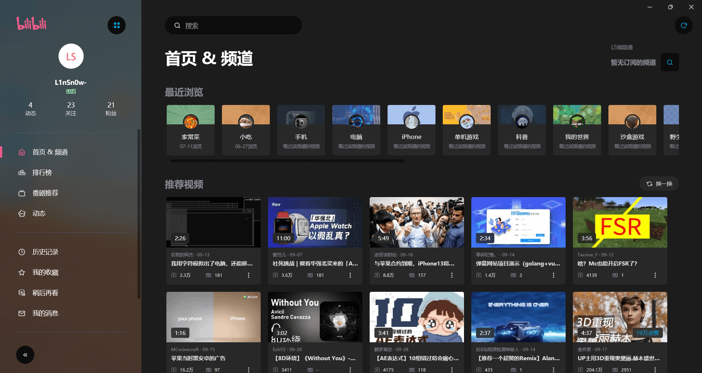
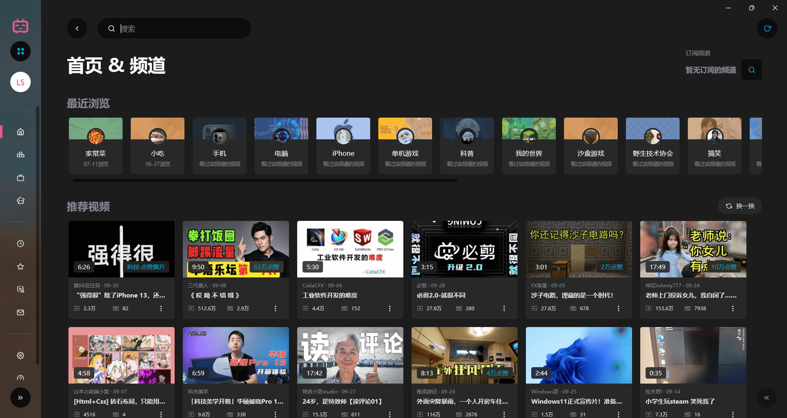
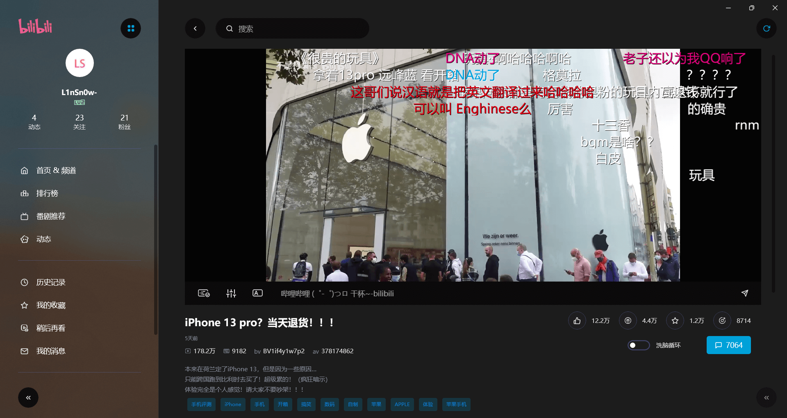
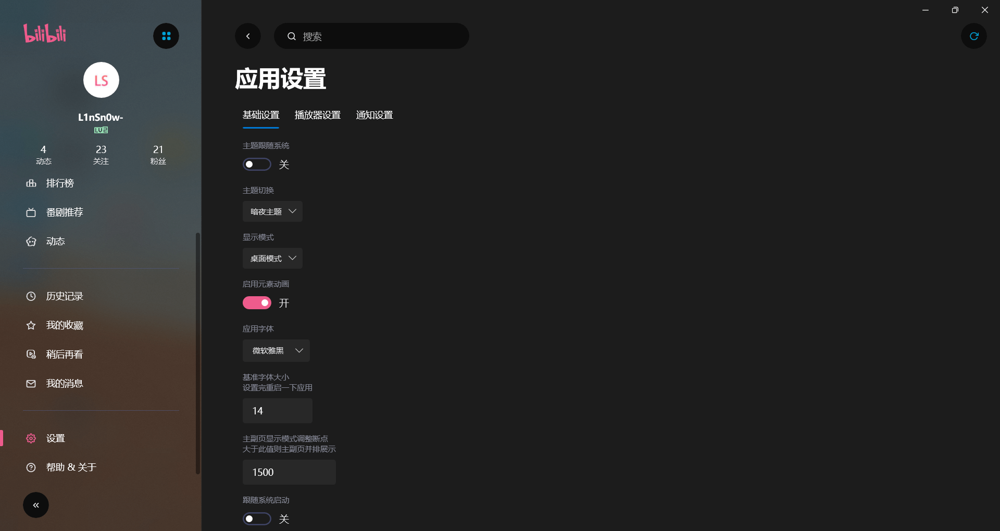
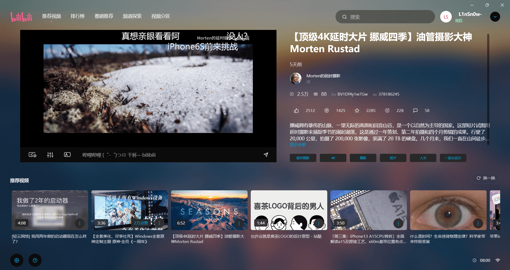
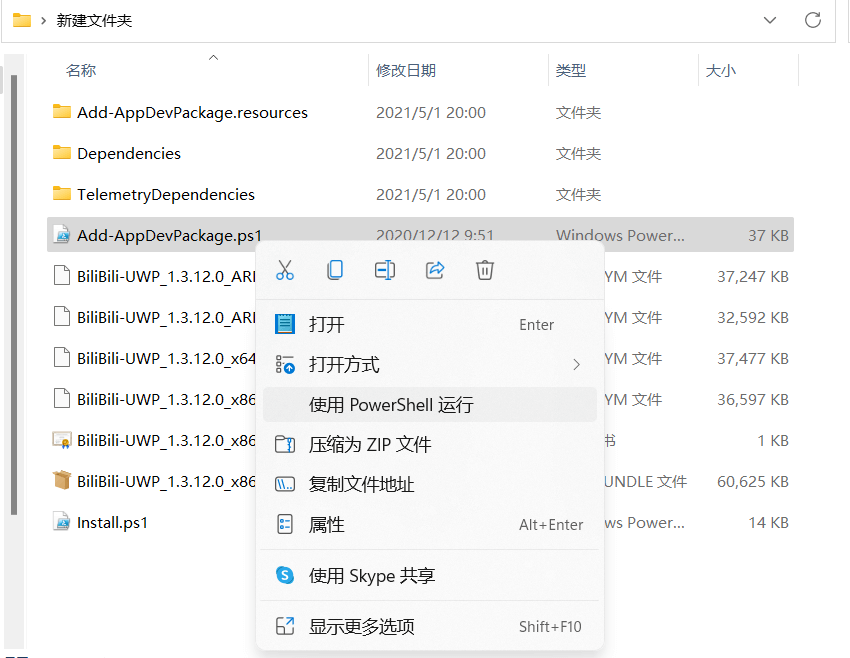

# 适合win11的开源哔哩哔哩客户端

## 前言

b站，现在几乎成了许多人每天闭上的网站之一。在电脑端，b站使用网页提供服务，当时在微软商店貌似也有uwp版的客户端，但使用体验并不好，功能少的可怜，设计界面也不是很好看，这么久了官方也不更新一下。。。。

不过还有，前阵子刚好逛b站的时候发现了一款名为——哔哩 的开源软件，接下来隆重介绍这款nb的软件。

## 什么是哔哩

> 软件简介：`哔哩`是一款设计精美的第三方UWP应用.

### 引用该项目的声明

> 我做这个应用一方面是出于对B站的喜爱，另一方面是对自己的一个挑战。我想尝试将一款移动应用解构并移植到桌面上，这能让我对移动交互与桌面交互有更深的理解。
>
> 但该项目由于一些不可抗力，已经停止开发。不再主动尝试修复bug（除非我自己遇到），也不再开发新的功能，目前已经在 **Microsoft Store** 中下架。
>
> 本应用出于学习的目的进行开发，不进行任何商业相关的行为。同时尽管应用能显示4K清晰度选项，但如果你不是大会员，则片源也不会是 4K。
>
> 尽管是原生 UWP ，但应用在 ARM 设备，比如` Surface Pro X` 上可能无法运行，我也不知道具体原因，可能要等有相关设备了才能测试。
>
> 应用不提供观看直播及视频下载的功能，原因固然是多方面的，但主要原因还是我没这需求。

## 软件截图

### 软件主界面

> 未缩放侧边栏

> 缩放侧边栏

### 播放界面

### 番剧界面

### 设置界面

### 平板模式

---

## 如何使用及安装

GitHub下载地址：

> https://github.com/Richasy/BiliBili-UWP/releases/

1. 下载软件的安装包

2. 解压到随便一个文件夹中

3. 用`powershell`打开`Add-AppDevPackage.ps1`

   

4. 根据提示运行完`Add-AppDevPackage.ps1`

5. 运行文件夹里的`Install.ps1`文件，同样使用powershell.

6. 等待安装完成后在开始菜单里打开app

## 结尾

感觉开发者无私的奉献，喜欢的可以去GitHub点个star，为开发者助力。