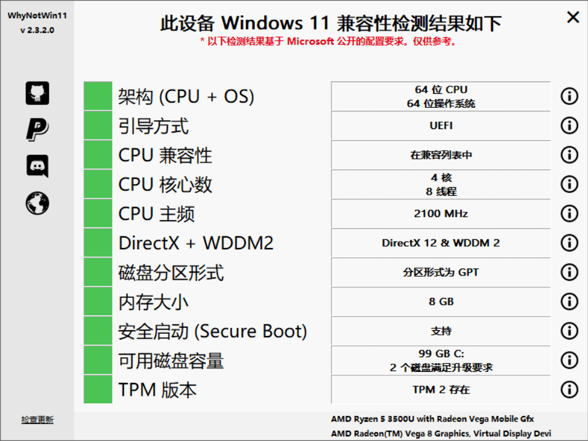
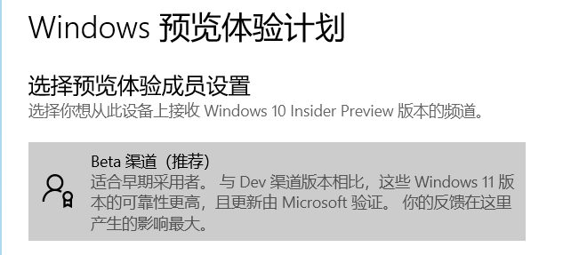
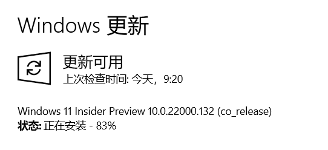
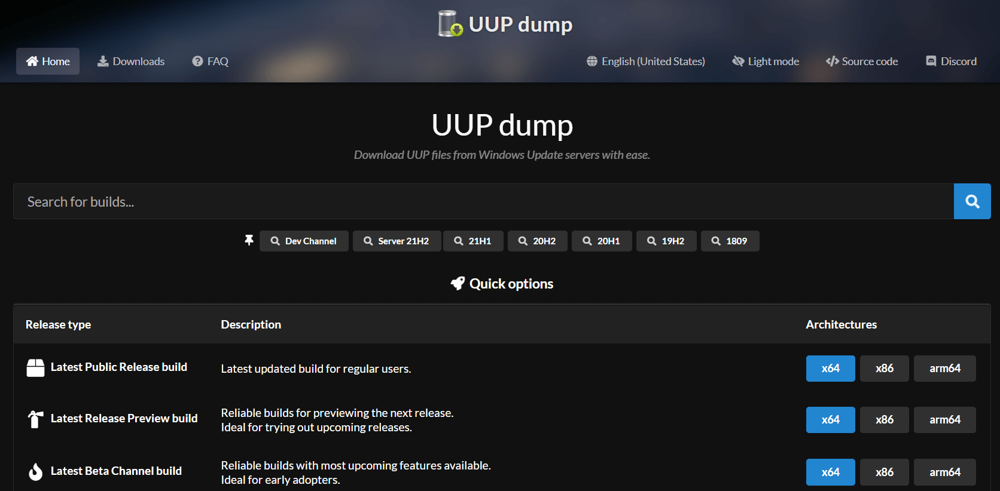

# Windows11从入门到入土

## 前言

Why？为什么有这篇文章，因为电脑win10系统出问题了........其实在Windows11泄露到dev频道开放测试的时候我就已经开始使用了，后来由于amd显卡驱动在windows11上突然奔溃了就有回到了Windows10，真是反反复复，现在Windows11也测试差不多两个月了，体验应该不会太差了，今天就冲了，奥里给哈哈哈哈。顺便就记录一下这个过程吧。

------

## WhyNotWin11

能更新就尽量不要重装了.......为什么不用官方检测工具呢，因为那玩意太操蛋了，比如检测结果是不合适的话也不会给你为什么不能安装的原因，好家伙，你是怕我安装上吗?当然有些设备检测为不能安装其实是没有关系的，直接用pe强制安装进去就行了，使用体验没差别，更新也会照样推送的。

大神`Robert Maehl`开发了`whynotwin11`，这是一款实用的windows11升级检测工具，为了帮助Windows用户知道他们的设备是否被支持，它的判断逻辑简单直接，比微软的官方解决方案做得更好。同时它还可以根据所有相关标准检查PC的升级资格，而且该应用已经多次更新。除此之外，whynotwin11能够帮助用户去检测任何导致无法升级到Windows 11的问题，这对发现和解决这些问题是有非常大的帮助，软件轻巧实用，完全不需要任何的安装，下载双击打开即可使用

> 工具地址：https://github.com/rcmaehl/WhyNotWin11

下面是我电脑的检测结果

> 如果检测不通过怎么办呢，不慌，下面会讲到解决方法
>
> 这里检测通过里就直接在设置里更新

------

## Win11预览版注册

> 打开设置-更新和安全-Windows预览体验计划-开始-链接一个微软账号就行了

### **这里我遇到过一个坑**

就是打开Windows预览体验计划后页面一篇空白，这个可能是在安装完Windows10以后设置不当导致的，具体解决方法在以下

> 打开设置-隐私-诊断和反馈-将诊断数据改为可选诊断数据就行了

### 注册完成

### 开始更新Windows11

------

## 检测不通过方案

> 既然检测不通过，那就只能采用强制手段了--利用PE安装
>
> 我个人比较推荐的pe还是[微PE](http://www.wepe.com.cn/)
>
> 网络上的pe一大堆，怎么顺手怎么来呗

获取Windows11镜像，由于MSDN目前无法获取到镜像，官网也不行，所以我们可以采用国外镜像源获取--[**UUP Dump**](https://uupdump.net/),打开这个网站，**找到下载界面，选择版本，语言和 Download using aria2, convert and create additional editions - 使用 aria2 下载, 转换和创建额外版本，把文件下载下来**，解压到某个你认为**行**的地方，**打开里面的后缀为.cmd的文件，等待运行完毕就会生成一个Windows11安装镜像在文件夹里**，这不是有手就行吗.然后你就可以拿着你的Windows11镜像去为所欲为了。

------

## 尾声

其实Windows11被喷的挺惨的，而我个人并不觉得怎么样，Windows11换了ui，采用圆角设计和大量的毛玻璃效果，这是目前比较流行的设计了，微软采用这个设计并融入了Windows11，这可能会影响未来几年或几十年的Windows，我认为我能够适应好并运用好它，而且等Windows11正式版出了就能原生支持安卓软件了，这不比模拟器香。其实网络上有大部分人只是跟风而已，**举个栗子啊**，macos一直采用的任务栏居中也没多少人在喷，还有开发者为此出macos dock的模拟软件用于改造Windows，这次Windows11出了任务栏居中翻倍被喷了，就离谱......
