# Windows11正式版!出发!

## 前言

2021年10月5号，微软正式发布了Windows11的第一个正式版.xdm,开冲.这篇文章，将带你无伤轻松的踏上Windows11的快船

## 🎉Why Windows11

个人认为Windows11非常值得升级.如果你具有一定的电脑使用基础，并且喜欢各种新的事物，那么可以试一试，或许能因此得到一个适合的操作系统。

　1、抛开win11界面上的改变，因为这是个人使用习惯的问题，无法讨论值不值得。

　2、win11相比之前的系统，拥有更加强大的性能，无论是办公还是玩游戏都更加流畅。

　3、同时，随着技术的更新，将会有大量新的插件、软件支持win11系统，而不支持曾经的系统。

　4、就像是此前的win10系统获得了大量win7所没有的技术支持一样。

　5、此外，win11还有着win10所不具备的兼容安卓app功能，能够直接安装使用安卓应用。

------

## 👋安装前的前提

在正式版推出前，我已经专门写过一篇关于Windows11安装的入坑指南。

如何确定自己的电脑是否能够直接升级，这很必要，因为直接升级能够省去很多的麻烦，无缝切换巴适得很.😂

### Windows11系统要求

### 硬件表检测（不推荐

系统要求这些是在电脑上安装 Windows 11 的基本要求。如果您的设备不满足这些要求，您可能无法在设备上安装 Windows 11，。如果您不确定您的电脑是否满足这些要求，您可向您电脑的原始设备制造商 (OEM) 进行核实，或如果您的电脑已在运行 Windows 10，那么您可利用[电脑健康状况检查应用](https://www.microsoft.com/zh-cn/windows/windows-11#pchealthcheck)来评估您电脑的兼容性。您的设备必须`已安装 Windows 10 的 2004 或更高版本`，才能升级。可在‘设置 > 更新和安全’中的 Windows 更新功能中获取免费更新。

| 硬件         | 要求                                                         |
| :----------- | ------------------------------------------------------------ |
| **处理器**   | **1 GHz** 或更快的，支持 64 位的处理器（双核或多核）或系统单芯片 **(SoC)**。 |
| **内存**     | 4 GB。                                                       |
| **存储**     | 64 GB 或更大的存储设备                                       |
| **系统固件** | 支持 UEFI 安全启动。                                         |
| **TPM**      | 受信任的平台模块 TPM 2.0 版本。                              |
| **显卡**     | 支持 DirectX 12 或更高版本，支持 WDDM 2.0 驱动程序。         |
| **显示器**   | 对角线长大于 9 英寸的高清 (720p) 显示屏，每个颜色通道为 8 位。 |

### 简单粗暴检查方法（推荐

看不懂上面的没关系，用下面的方法也行.

#### 使用官方的检测工具

由于一开始官方的检测工具不怎么好用，但现在已经改善了，所以可以去下载一个试试.

> 官网下载地址：[pchealthcheck](https://www.microsoft.com/zh-cn/windows/windows-11#pchealthcheck)
>
> 注意：打开这个链接后可能找不到软件的下载地址，幸运的话应该可以直接看到下载地址，如果看不到就需要划到底部，展开某个问题就能看到下载地址了，
>
> 如图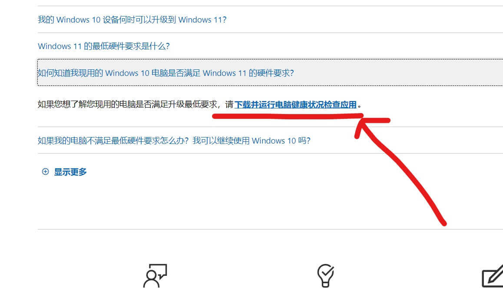

1. 打开官方检测工具并点击立即检测

   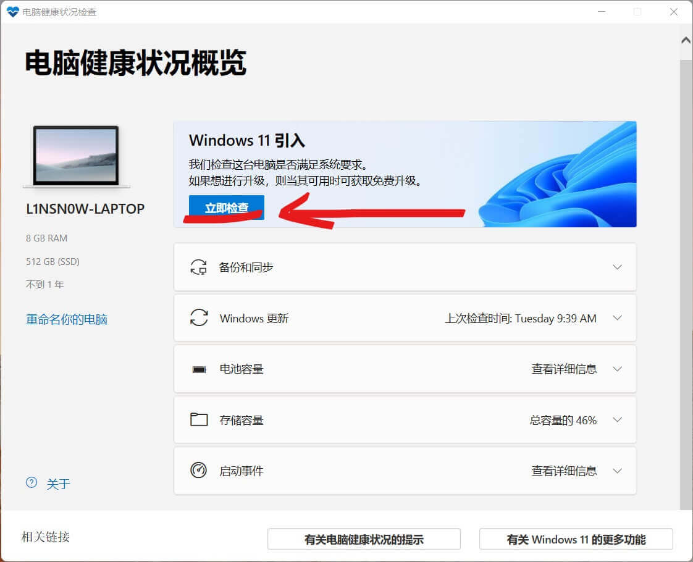

2. 查看是否符合系统要求

   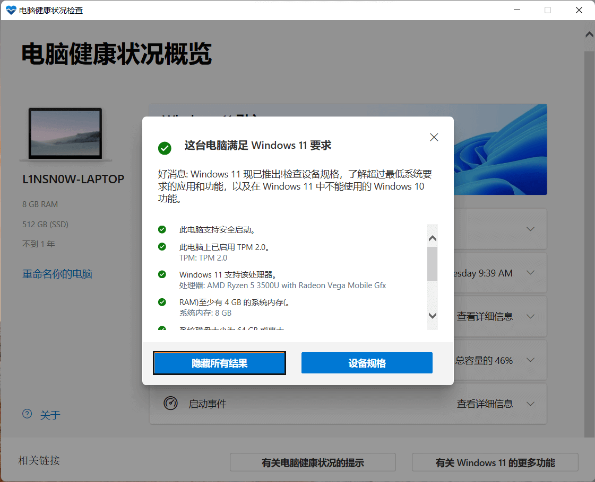

#### 使用WhyNotWin11

大神`Robert Maehl`开发了`whynotwin11`，这是一款实用的windows11升级检测工具，为了帮助Windows用户知道他们的设备是否被支持，它的判断逻辑简单直接，比微软的官方解决方案做得更好。同时它还可以根据所有相关标准检查PC的升级资格，而且该应用已经多次更新。除此之外，whynotwin11能够帮助用户去检测任何导致无法升级到Windows 11的问题，这对发现和解决这些问题是有非常大的帮助，软件轻巧实用，完全不需要任何的安装，下载双击打开即可使用

> 工具地址：https://github.com/rcmaehl/WhyNotWin11

下面是我电脑的检测结果

#### 不通过检测方法怎么办

不通过不慌，其实不通过就是不能直接升级到windos11而已，那么我们可以通过u盘直接安装就行。与Windows10类似。下面会讲到方法

## 👨‍💻获取Windows11

Windows11官方获取网站

> 官网链接： https://www.microsoft.com/zh-cn/software-download/windows11

### 使用Windows 11 安装助手

> 这种方法适合于已有Windows10的用户，能够直接使用这个安装助手升级到Windows11。将工具下载下来并运行，跟着软件的提示操作就好了，有手就行，十分简单.....

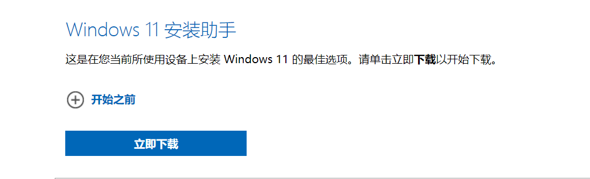

### 使用u盘安装

这个方法是我本人比较推荐的，**`检测不通过`**应该也可以通过这种方法安装上Windows11，当然你需要有一个u盘（大于等于8G)

#### 使用官方工具刻录U盘

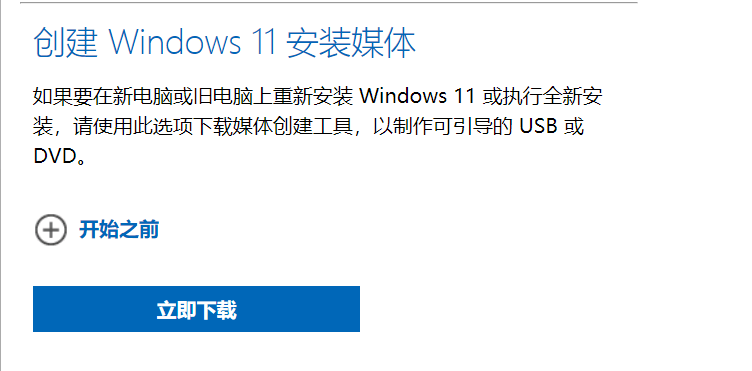

1. 点击立即下载将工具下载下来

2. 运行该工具

3. 然后插上u盘

4. 接受条款

   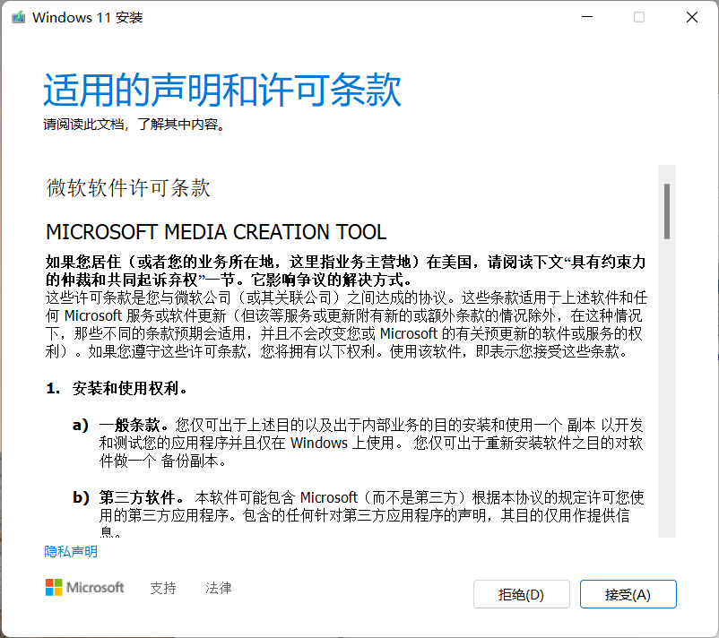

5. 一般默认就行，然后下一步

   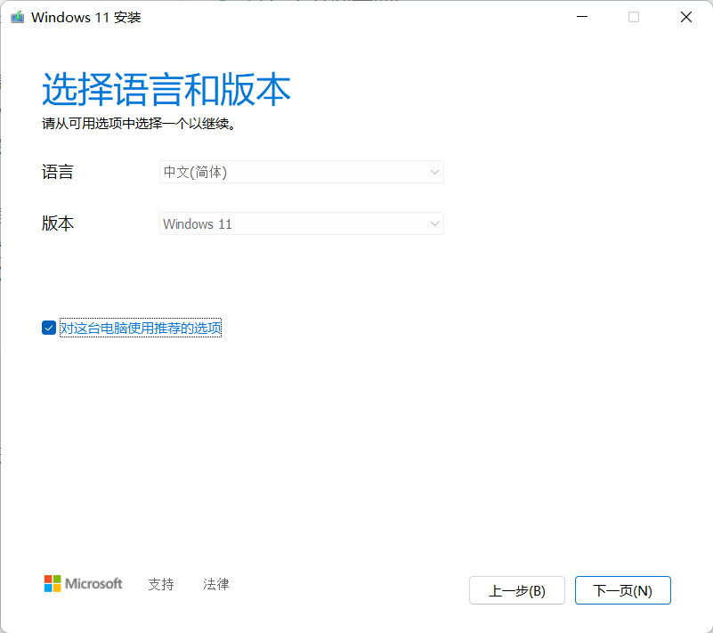

6. 选择使用的介质，那当然是U盘

   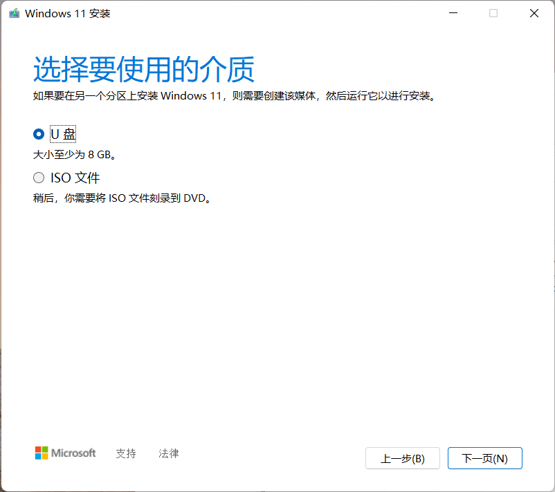

7. 选择自己插上的u盘，然后下一步

   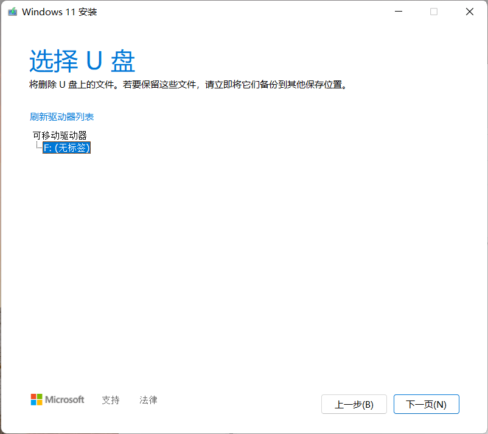

8. 等待刻录完成后就可以了

   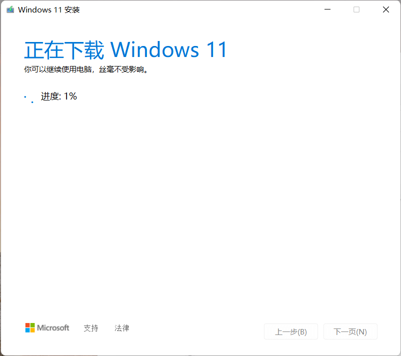

#### 使用U盘PE安装

> 这种方法也能够解决Windows检测不通过
>
> 我个人比较推荐的pe还是[微PE](http://www.wepe.com.cn/)
>
> 网络上的pe一大堆，怎么顺手怎么来呗

> 提前将微pe刻录进u盘后把Windows11放到u盘里就行，这里就不重复造轮子了，自己百度一下就行
>
> Windows11镜像可以从官网获取，也可以从[MSDN](https://next.itellyou.cn/)获取，或者从国外镜像源[**UUP Dump**](https://uupdump.net/)获取，都行。

从官网获取镜像iso(推荐

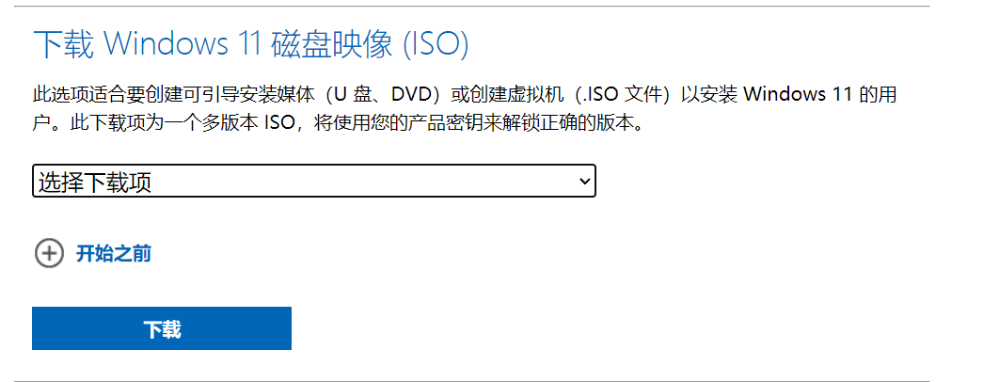

下载下来之后把镜像放到有pe的u盘里就可以了，具体怎么用pe安装百度一下就有了

## 🍔结语

这篇文章有点肝，哈哈哈哈，快去冲Windows11....