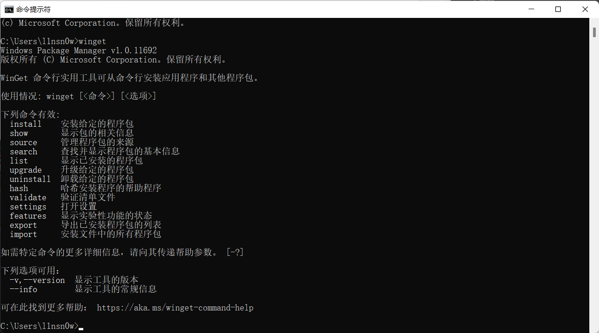
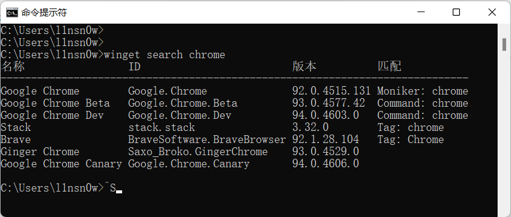

# Windows包管理器Winget快速入门

## 前言

微软 Windows 软件包管理器 winget已经发布了，winget 是 Windows 软件包管理器的 CLI（命令行界面），类似于 Linux 上的软件包管理器，用户可以通过 winget 命令行工具发现、安装、升级、删除和配置特选应用程序集。安装后，用户可以通过 Windows Terminal、PowerShell 或 CMD 访问 winget。假如你已经习惯了使用Linux的包管理器，那么winget就可以快速上手，运用winget可以快速给Windows安装软件....

------

## 获取winget

> 从winget的github获取：https://github.com/microsoft/winget-cli

------

## Winget常用命令

### 获取帮助

直接输入命令 winget，能获取基本帮助，包括命令格式和命令参数。

```shell
winget
```

### **使用情况:** 

```shell
winget [<命令>] [<选项>]
```



### 搜索软件

以搜索**chrome**为例,

```shell
winget search chrome 
```

**输出结果**



### 安装软件

```shell
1. winget install Package  #Package 为软件包名称或软件包的id
 2. winget install Package --rainbow #加上--rainbow的参数可以让进度条显示为彩色，否则显示为单色
```

### 查看软件的详细信息

```shell
winget show package
```

### 软件源管理

WinGet 提供了一个 `source` 的命令，利用 `winget source <command>`，我们就可以方便地管理不同的 WinGet 软件 Manifest 仓库，WinGet 官方称之为「软件源」

```shell
winget source add <软件源>  # 添加新的软件源
winget source list  # 列出当前已添加的软件源
winget source update  #  更新当前全部添加的软件源
winget source remove # 移除当前使用的软件源
```


## 小结

这玩意跟Linux没法比，但能用，用起来也还不错，有至少比没有好，估计经过多次迭代会越来越好,建议配合Windows Terminal一起用

。winget的命令不是很多，常用的那几条记一记就够用了
