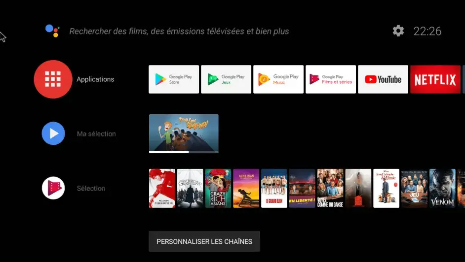
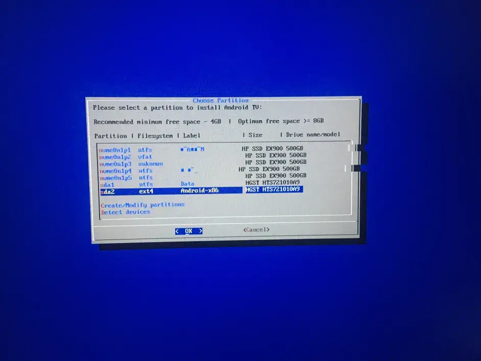

## Begin:

I went to Xiaopo Station as usual. Although I am not an Android professional, but with the foundation of iOS jailbreak, a broken Android phone and the WSA launched on Windows 11, I began to understand some things in the field of Android. , The big data is really powerful. After swiping and swiping, they sent me a video of Xiaomi box brushing `AndroidTV`. I didn't expect TV boxes to do this. This moment reminded me of being dominated by various advertising pop-ups of Xiaomi boxes. Fear, this time it is saved, without saying a word, just start working.
🤣

## 🤔What is the AndroidTV?

> AndroidTV is a smart TV platform developed by Google

The whole system occupies a small space, there are no advertisements, the animations and ui are very good-looking, and the Google service is built-in. Anyway, it is probably such a thing. Generally, if you want to use this system, you need to buy some TV boxes of the international version.

## 😅Start:

Turn on the TV, and have a brief look at the model of the TV box. Mine is MDZ-16-AA, with only 4g of memory, and I have only installed two software. For the special card, it is estimated that it is only a dozen frames. The usb port is poor, so I gave one... The process of flashing the phone is similar to that of an Android phone. It is also to flash twrp first, and then use twrp to flash other systems. In order to be lazy, I follow the The simple method on the Internet is to downgrade the box first, then root, and then flash into twrp, and then I overturned the car. I thought the TV box was bricked, but I checked it online, but I didn’t expect to save the brick. It can be said that God helped me. , After taking a closer look at the method, it is not difficult but rather troublesome. The specific process will not go into detail. There are many online. The following is a record of the pits I encountered...

> 1. I don't have a male-to-male usb cable, but I didn't want to wait for the courier, so I made one. Seriously, I won't die if I don't do it. I connected the homemade cable to the two usb ports on the laptop, and the laptop burned out. Broken a usb port, it hurts me to death, sorry, it seems that this cable can't be used, so I can only buy one obediently
> 2. At first, I didn't know that the Mi box must be connected to the computer and other usb devices, and the adb debugging mode must be turned on. As a result, after entering the recovery mode, twrp automatically deletes the built-in system, resulting in only twrp when booting, and then the remote control and mouse cannot be used. , entered a dead end with serious consequences
> 3. To use the remote control to enter the automatic flashing machine, you must first delete the connection of the remote control in the Xiaomi box, otherwise you will not want to use the remote control to enter the automatic flashing machine, because I have been doing this step for a long time, and then I saw the solution on the Internet. scheme, and different models have different buttons to enter the automatic flashing machine, a batch of pits
> 4. Many Android resources on the Internet are unavailable, and various assistants and root tools are also ineffective. The resources are very complicated, which is really annoying. It took several hours just to find various resources.
> 5. To save the bricks, the millet box needs to be disassembled. It is impossible to open this thing by hand. It took about an hour and a half to disassemble it with tools, and the hands are useless.
> 6. To connect to the computer after disassembly, you must short-circuit the 2 and 3 contacts at the moment of plugging in, and try repeatedly until you connect to the computer and use a software to force the system into the system, but various errors will be reported, and it will not work after many attempts. , the error is reported only 4%, it is best to check a lot of information before seeing a related content, the reason is that this software has problems running on amd, but my intel mini host is installed with macos, so I want to save the box. I can only install the small host back to Windows, and finally successfully solved the error

## 😍The effect after a series of tossing:

> Android version：Android5.1.1
>
> Firmware comes with supersu
>
> Support Google Play Store and YouTube
>
> and so on...


### 😅Let me see:


Sorry for the bad shot, just take a look

### 🤔The experience after the box is flashed

Generally speaking, it is very good, at least there are no ads and all kinds of memory are insufficient, but it is still a bit difficult to watch YouTube with crash in the box, because the box has insufficient computing power, so it can only be reluctant. It is recommended to use a soft router or a router. Patriotic Internet Directly

## 😅Take it to the next level

After tossing a series of millet boxes, once again with the help of big data, I flashed an ancient project: `Android TV X86`, which is really a link, just in front of me, the mini host has flashed windows, anyway, mainly With my laptop, I might as well flash it to AndroidTV, which can also solve the problem of slow Internet access in patriotism. With the large capacity of the hard disk, this garbage can be put to good use. The ancient cpu of i3-4360 runs Android can kill most ordinary TV boxes in seconds, just do it...

## 😍Let me see:



## 🤔So,What is the Android TV X86

> Android TV x86 **created by developer AmznUser444 Dev**. Because the root of the ROM is the Android-x86 project. The initial version was based on Android 9 Pie, and its system requirements only required a 1.2 GHz dual-core 64-bit capable processor, and a typical Intel/NVIDIA/AMD GPU with 64MB of video memory.

Simply put, it is a system that allows your computer to run Android TV.

## 🥱Find the resources you need

This thing seems to be produced by only two foreign teams. In order to get the latest version, I Googled it and joined the `discord` of these two teams, but one of them seems to have not been developed, and the version is stuck at `Android 9` `Only the other one is still under slow development. The latest AndroidTV version is `Android11`, but the author will charge for mirror download, about 10 euros. Anyway, I really can't afford it, so I only Can download its free version, the free one is `Android 9`, comfort yourself and say: It's enough anyway.

After some understanding and practice, the AndroidTV x86 produced by the team that has not been developed encountered some problems during the installation process. It is estimated that my food or mirroring is not good, so it is recommended to use the AndroidTV that is still under maintenance.

## 🤔practice process

1. Partition the hard disk in advance, and set the name of the hard disk to remember. The format is set to `ext4`. I probably divided it into 64GB, but in fact, I don't need so much, it's too wasteful, 10G is probably enough.
2. Download `Android TV x86` image and `Rufus` burning software, Rufus official website: https://github.com/pbatard/rufus/releases/
3. **Rufus** open to see if the U disk is displayed and then select the image, the partition type is set to `MBR`, the boot is set to `BIOS or EFI`, the file system is set to `Large FAT32`, otherwise the default is OK, Then burn it directly to the U disk in ISO mode at the beginning


4. Restart the computer and enter the bios to set the boot sequence of the U disk or directly press the shortcut start button to start. Different motherboards correspond to different buttons. Baidu, pay attention to the BIOS settings to turn off the secure boot


5. Enter the installation interface and select **installation - Android-x86 to harddisk** (just **Run Android x86** if you don't want to install to the hard disk)


6. Select the hard disk that Android TV x86 needs to install (**hard disk partition in advance**),



7. choose ext4,


8.  Prompt to select all **YES**，


9. After the installation is complete, you can unplug the U disk. If you do not enter the system, you can check the boot sequence.


### 🙌Note after installation：

> Skip the Paypal QR code interface

1：press Ctrl+alt+F1

2：input

```shell
 pm disable com.tosanthony.tv.networkprovider
```

then  press (Enter)

3：Press Ctrl+alt+F7 or F8 back to Main interface


> Crude way of setting interface skipping auto-update and google login:

1.press Ctrl+alt+F1 to enter Console
2.input

```shell
pm disable com.google.android.tungsten.setupwraith
```

3.press Enter
4.Ctrl+alt+F7 ，（If your home network is already patriotic, you don't have to skip Google login.）

> How to install software with adb?

1. Download the application to the U disk, insert the U disk
2. Press Ctrl+Alt+F1 to enter the console,
3. Type `cd storage`, then press Enter,
4. Enter ls again, and then press Enter. Generally, the first name displayed is the name of your U disk.
5. Enter `cd your u disk name`, you can enter the first few letters of the u disk name and then press the tab key to automatically complete
6. Enter ls again and press Enter to find the apk installation package according to your U disk directory
7. Use the cp command to copy the apk to the /data/local/tmp directory

E.g

```shell
cp bilibili.apk （Note that there is a space）/data/local/tmp/bilibili.apk
```

Enter the tmp directory and enter cd /data/local/tmp

Install apk, enter pm install bilibili.apk and output Success indicates successful installation

Press Ctrl+alt+F7 to return to the main interface

It is recommended to install Dangbei Market for the first software, because you can directly download and install many commonly used software in the back without entering the code.

> Enable arm compatibility

1. Download the corresponding houdini file, houdini9_y.sfs

2. Copy to U disk

3. Press Ctrl+Alt+F1 to enter the console and save the file in the storage/.. directory

4. Enter the same as above, enter ls

5. Find the storage directory, enter cd U disk name to enter your U disk, enter ls, and check whether the houdini9_y.sfs file you copied is in the current directory.

6. Enter

```shell
cp houdini9_y.sfs /system/etc
````

and press enter

7. Enter

```shell
enable_nativebridge
````

and press enter

8. Enter

```shell
reboot
````

and press enter

> Remote control:

After installing the Wukong remote control for AndroidTV, you can use your mobile phone as a remote control, or buy a usb remote control for about ten yuan

-----

## 🎈Android TV x86 experience:

Although it can only be 1080p, the display is still very clear. It also supports Google services, but it can't use Netflix. It is very comfortable to use in general...

## 🎈Android TV x86 resource and link summary:

> In order to get rid of the speed limit of Baidu network disk, I transferred the file to Alibaba cloud disk, and changed the suffix to mp4, so after downloading it, I can change it to iso, and the downloaded houdini9_y.mp4 should be renamed to houdini9_y.sfs

AndroidTV mirror file link:

````
https://www.aliyundrive.com/s/oPYD7AHJJc3
````

Rufus burning software link:

````
https://github.com/pbatard/rufus/releases/
````

Dangbei Market Link:

````
https://www.dangbei.com/
````

houdini9_y.sfs download:

````
https://www.aliyundrive.com/s/oPYD7AHJJc3
````

discord group:

```
https://discord.gg/yUwdq8x 
```


---

