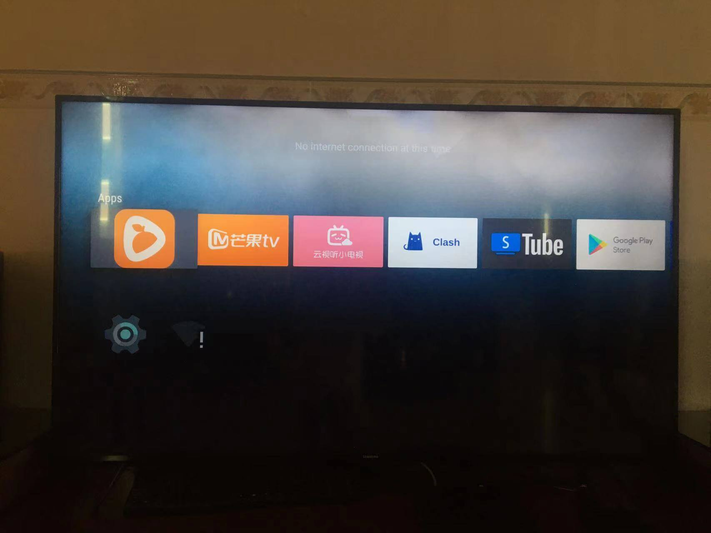
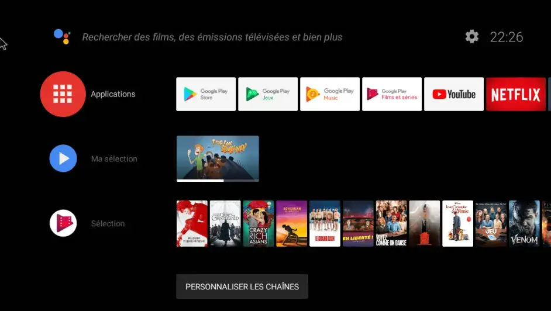
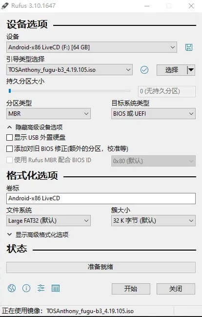
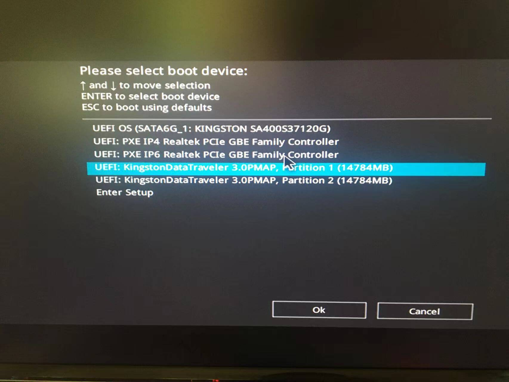
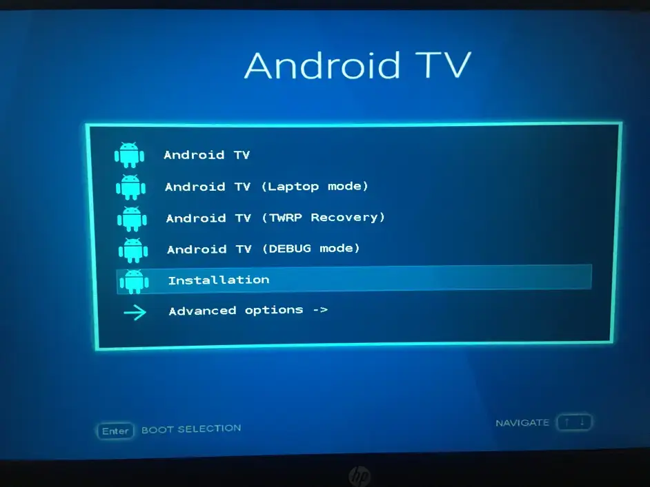
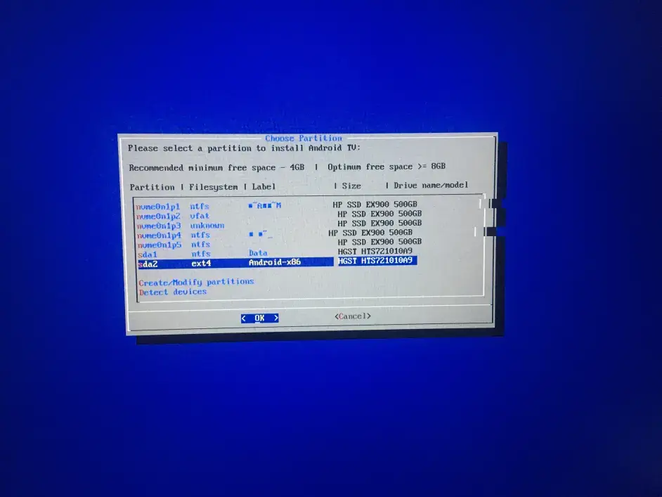
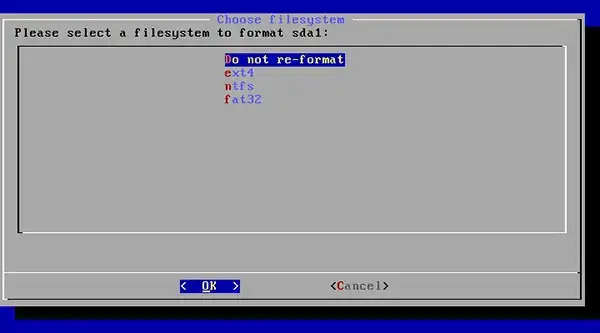
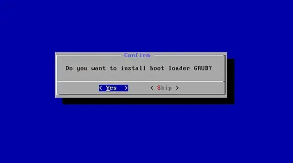
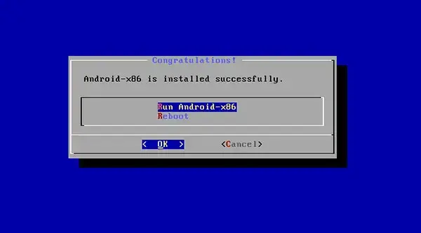

## 起因

我向往常一样逛着小破站，虽然我不是什么玩安卓的专业人士，但是有了iOS越狱的基础，一台破安卓手机和Windows11上推出的WSA,我开始的了解了一些安卓领域的东西，大数据真的厉害，刷着刷着就给我推送了小米盒子刷`AndroidTV`的视频，没想到电视盒子也能这么搞，这瞬间让我想起了被小米盒子各种广告弹窗支配的恐惧，这下子算是有救了，二话不说，直接开干。🤣

## 🤔什么是AndroidTV?

> AndroidTV就是Google开发的智能电视平台

整个系统占用小，没有各种广告，动画和ui都很好看而且内置谷歌服务，反正大概就是这么个东西，一般要使用这个系统都是买国际版的一些电视盒子

## 😅开整

打开电视，初略的了解一下电视盒子的的型号，我的是MDZ-16-AA,就4g的内存，才安装了两个软件，就天天提示清理垃圾，安装爱奇艺或者腾讯视频使用起来特别卡，估计也就十几帧吧，usb口少的可怜，就给了一个...刷机的过程和安卓手机差不多，也是先刷twrp，在用twrp刷别的系统，为了偷懒，我按照网上的简单方法，就是先给盒子降级，然后再root,再刷入twrp，然后我就翻车了，本来以为电视盒子成砖了，网上查了查，没想到能救砖，可谓是天助我也，仔细看看了方法，也不是很难就是比较麻烦。具体过程就不细说了，网上很多，以下就记录下我遇到的坑...

> 1. 没有公对公的usb线，但是又不想等快递，所以就自制了一条，说真的，不作就不会死，我拿自制的线连到了笔记本上的两个usb口，结果笔记本烧坏了一个usb口，心疼死我了，害，看来这条线估计是不能用吧，只能乖乖买一条了
> 2. 一开始不知道小米盒子连接电脑和其他usb设备必须开启adb调试模式，结果进入了恢复模式后twrp自动把内置系统给删了，导致开机只能进twrp，然后又用不了遥控器和鼠标，进入了死胡同，导致了严重后果
> 3. 用遥控器进入自动刷机必须要在小米盒子里先把遥控器的连接删除才行，否则别想用遥控器进入自动刷机，因为这一步我搞了半天，后来才在网络上看到解决方案，而且不同型号进入自动刷机的按钮不一样，坑的一批
> 4. 网络上的安卓资源很多都不能用了，各种助手和root工具也失效了，资源十分冗杂，真的是烦，光是找各种资源就花了好几个小时
> 5. 救砖要把小米盒子拆开，这东西根本不可能用手才开，用工具拆就花了差不多一个半小时，手都废了
> 6. 拆开后要连接电脑必须要在插电瞬间短接2，3触点，反复尝试，直到连上电脑，使用一个软件强制刷入系统，但是会各种报错，试了很多遍也不行，才4%就报错，最好查了很多资料才看到了一条有关的内容，原因是这个软件在amd上运行有问题，但是我的intel迷你小主机装的是macos，于是乎要救盒子我只能把小主机装回Windows，最后才成功解决了报错

## 😍一系列折腾之后的效果

> 安卓版本：Android5.1.1
>
> 固件自带supersu
>
> 支持Google Play Store以及YouTube
>
> 等等...

### 😅让我康康



拍的不好见谅，简单的看一下就行

### 🤔盒子刷机后的体验

总体来说很不错，至少是没广告和各种内存不足了，但是看在盒子里装clash看YouTube还是有点吃力，原因是盒子算力不够，只能勉勉强强，推荐是用软路由或者路由器直接爱国上网

## 😅更上一层楼

在折腾了一系列小米盒子后，再一次凭借大数据，我刷到了一个古老的项目：`Android TV X86`,真是一环扣一环，刚好我前面的迷你小主机刷了windows，反正主要是用我的笔记本，不妨把它也刷成AndroidTV,也正好能解决爱国上网慢的问题，加上硬盘超大容量，捡的这台垃圾也算是能好好利用一下了，i3-4360的远古cpu跑个Android是可以秒杀现在大部分普通电视盒子的，说干就干...

## 😍先让我康康



## 🤔So,什么是Android TV X86

> Android TV x86 **由开发者 AmznUser444 Dev 创建**。 因为 ROM 的根源是 Android-x86 项目。 最初的版本基于 Android 9 Pie，其系统要求只需要具有 1.2 GHz 双核 64 位功能的处理器，以及 64MB 视频内存的典型 Intel / NVIDIA / AMD GPU。

简单来说就是能让你的电脑跑Android TV的一个系统

## 🥱寻觅所需资源

这个东西好像只有国外两个团队再制作，为了获取到最新版，我Google了一下，并且加入这两个团队的`discord`，不过其中有一个好像已经没有开发了，版本停留在了`Android 9`只剩下另一个还在缓慢开发，目前最新的AndroidTV 版本是`Android11`，不过作者镜像下载要收费，大概是10欧元左右吧，反正我这种穷屌丝是真的负担不起，于是只能下载它的免费版本，免费的是`Android 9`，安慰自己说：反正也够用了。

经过一番了解和实践，其中那个已经没有开发的团队制作的AndroidTV x86在安装过程中遇到了些问题，估计是我菜或者镜像不行，所以推荐使用还在维护的AndroidTV.

## 🤔实践过程

1. 提前将硬盘分区，并设置好记的硬盘名称，格式设置成`ext4`,我大概是分了64GB,不过其实不用这么多，这太浪费了，10G估计就行了
2. 下载`Android TV x86`镜像和`Rufus`刻录软件,Rufus的官网：https://github.com/pbatard/rufus/releases/
3. **Rufus**打开看是否显示U盘 然后选择镜像即可，分区类型设置为`MBR`,引导设置为`BIOS或EFI`,文件系统设置为`Large FAT32`,其他的话默认就行，然后直接一开始以ISO方式刻录进U盘



4. 重启电脑进入bios设置u盘启动顺序或者直接按快捷启动按键启动，不同主板对应按键不同，自行百度，注意BIOS设置把安全启动关了



5. 进入安装界面选择 **installation - Android-x86 to harddisk**(不想安装至硬盘的直接**Run Android x86**就行)



6. 选择Android TV x86需要安装的硬盘(**硬盘提前分区**),



7. 选择ext4,



8. 出来提示全部选择 **YES**，



9. 等待安装完毕就可以拔掉U盘了，如果没有进入系统的话可以检查一下启动顺序




### 🙌安装完后注意：

> 跳过Paypal二维码界面

1：按 Ctrl+alt+F1

2：输入

```shell
 pm disable com.tosanthony.tv.networkprovider
```

然后按 回车(Enter)

3：按 Ctrl+alt+F7或F8 回到主界面


> 设置界面跳过自动更新和谷歌登录的粗暴方法:

1.Ctrl+alt+F1进入Console
2.输入

```shell
pm disable com.google.android.tungsten.setupwraith
```

3.回车
4.Ctrl+alt+F7 ，（如果家里网络已经爱国上网的话就不用跳过谷歌登录了）

> 如何用adb安装软件？

1. 下载应用到U盘，插入U盘
2. 按 Ctrl+Alt+F1 进入控制台，
3. 输入`cd storage`，然后回车，
4. 再输入ls,然后回车，一般显示的第一个名字就是你的u盘名字
5. 输入`cd 你的u盘名字`，可以输入u盘名字的前几个字母然后按tab键自动补齐
6. 再输入ls并回车，根据你的u盘目录找到apk安装包
7. 使用cp命令将apk拷贝到 /data/local/tmp 目录下

例如 

```shell
cp bilibili.apk （注意这里有一个空格）/data/local/tmp/bilibili.apk
```

进入tmp目录，输入 cd /data/local/tmp

安装apk，输入pm install bilibili.apk 输出 Success 说明安装成功

按Ctrl+alt+F7 回到主界面

建议第一个软件安装当贝市场，因为后面很多常用的软件你都可以在里面直接下载安装，不用再输入代码了。

> 开启arm兼容 

1、下载对应houdini文件，houdini9_y.sfs

2.拷贝到u盘

3、按 Ctrl+Alt+F1 进入控制台，文件保存在storage/.. 目录下

4.输入同上，输入 ls 

5.找到storage目录，输入 cd u盘名称 进入你的U盘，输入ls，查看你拷贝的 houdini9_y.sfs 文件是否在当前目录。

6.输入

```shell
cp houdini9_y.sfs /system/etc
```

并回车

7.输入

```shell
enable_nativebridge
```

并回车

8.输入

```shell
reboot
```

并回车

> 遥控器：

给AndroidTV安装悟空遥控后就可以拿手机当遥控器了，或者买个usb遥控器，大概十几块钱

-----

## 🎈Android TV x86体验

虽然只能1080p,但是显示还是挺清晰的，同样的支持Google服务，但是不能用奈飞，总体使用起来非常舒服...

## 🎈Android TV x86资源及链接汇总：

> 为了摆脱百度网盘的限速，我把文件传到了阿里云盘，并且把后缀改成了mp4,所以下载下来后改成iso就行，下载下来的houdini9_y.mp4要把名字改成houdini9_y.sfs

AndroidTV镜像文件链接：

```
https://www.aliyundrive.com/s/oPYD7AHJJc3
```

Rufus刻录软件链接：

```
https://github.com/pbatard/rufus/releases/
```

当贝市场链接：

```
https://www.dangbei.com/
```

houdini9_y.sfs下载：

```
https://www.aliyundrive.com/s/oPYD7AHJJc3
```

discord群组：

```
https://discord.gg/yUwdq8x 
```


---

