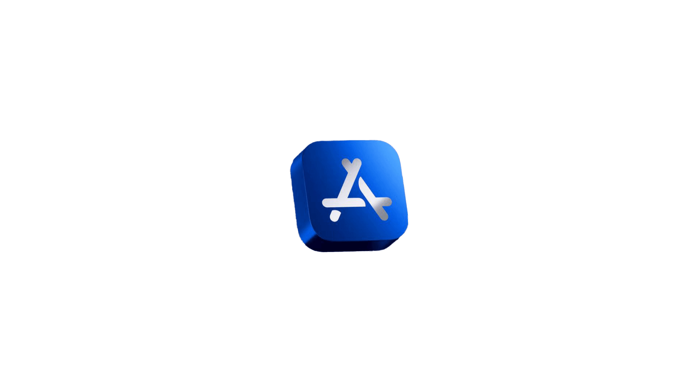
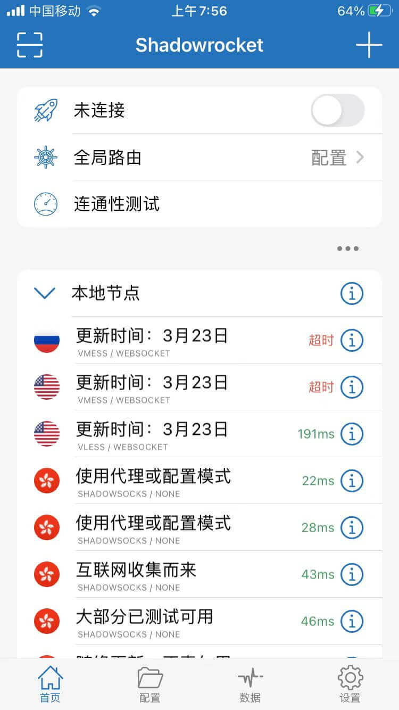
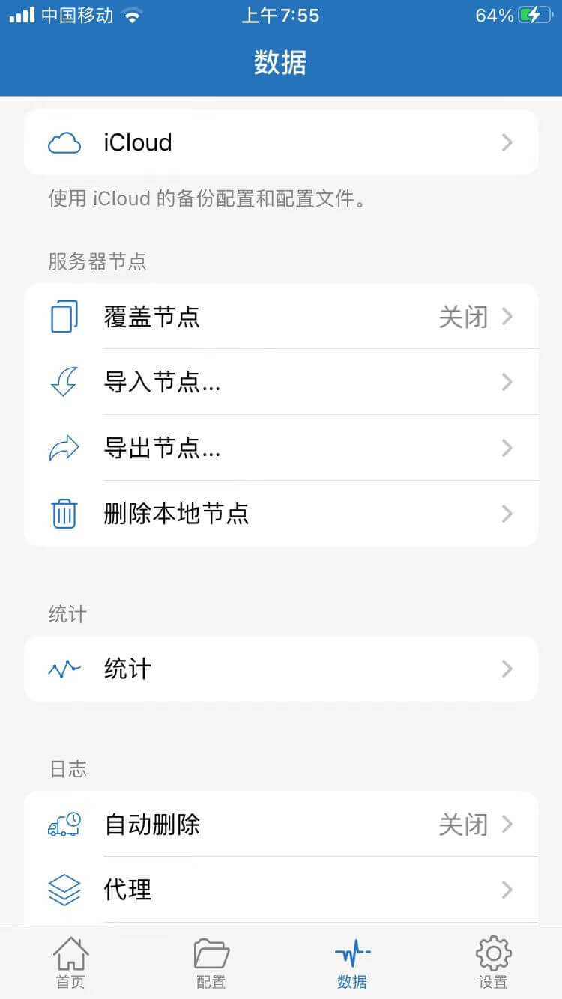
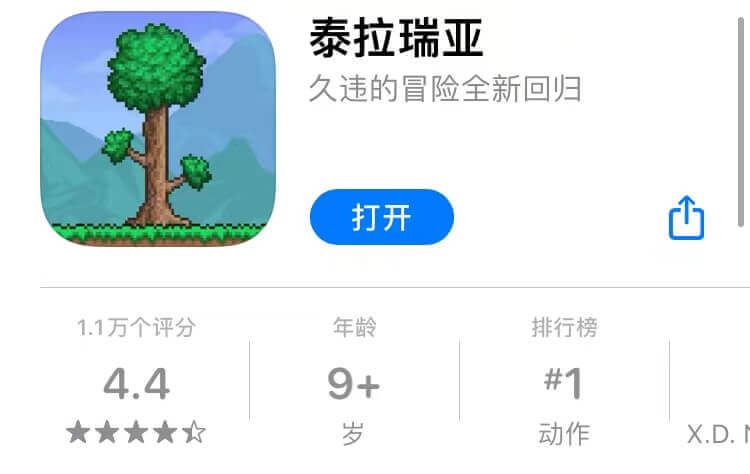
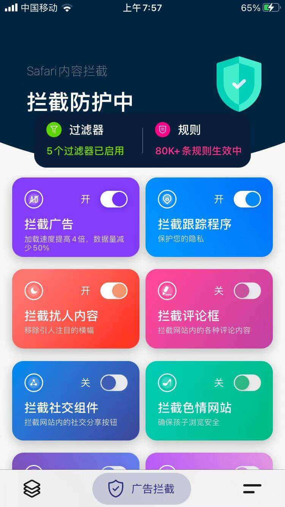
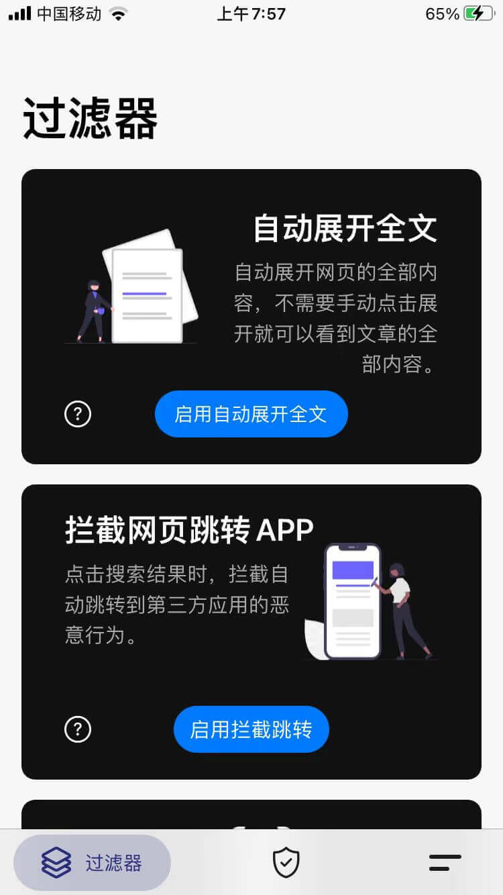

## 所谓的AppStore？

`AppStore`, 从字面上看就能知道它的作用了，是的，通过AppStore，我能轻松的获取到各种我需要的软件，作为一个商店，里面大部分软件是免费的，但是有些是收费的，并且AppStore会根据不同国家会提供不同的App,这大概就是你使用AppStore需要了解的一些东西吧。

## 🙌网络工具之Shadow Rocket

 

ShadowRocket，俗称小火箭。这是一个功能十分强大的网络工具，一般要配合节点使用，支持各种协议，如ssr，ss等等，而且也支持通过iCloud同步和备份节点，整个软件十分简洁，使用起来很舒服。当导入一些节点之后，我就开始遨游于更大的一个互联网世界.不过该App不在国区上架,还好前一阵子我注册了一个美区账号，并且用`Apple Gift Card`充了3美刀进去，刚刚后够买。官方的TeleGram群组非常活跃。ShadowRocket是买断制的，花了2.99$到手.我觉得这是我买的最值的一个手机app了.

## 😛手游之Terraria

Terraria,中文名是泰拉瑞亚.这个游戏一开始是在b站看别的up主玩发现的,一些网友对于泰拉瑞亚的评价很高，我觉得泰拉瑞亚和`MineCraft`挺像的，虽然Terraria是一个`2D平面`游戏。正式它是个`平面2D`游戏，不怎么吃性能，对于我的`iPhone 6s`还是比较友好的。平时使用的iPhone6s在性能上已经有亿些落后了😂，对于一些大型的游戏如`原神`，王者等已经带不怎么动了，因此我转向了一些小巧的游戏，这是我选Terraria的一个原因。既然我都有电脑了，为什么还要玩手游？其实，现在是快节奏的时代，很多时候使用电脑玩游戏稍有有亿点繁琐或费时，而手游能够让我利用到我的`碎片时间`，还能很方便地和盆友`联机`，满足了我的社交需求，所以这些是我选择泰拉瑞亚的另一个原因。泰拉瑞亚玩法很新颖，而且还有Wiki可供查看，也支持云端存储数据，感觉非常的不错👍。

Terraria分为国服和国际服，同样也是买断制的，虽然国际服版本更新较快，但是`汉化`不完整，并且`价格`也是个大问题，国服原价是18元，活动降到了12元，配合支付宝的Appstore红包，最终是用了`2.52`元买到手了。

## 🛡️浏览器插件之广告屏蔽

这个Safari的一个浏览器扩展，软件十分精致，受够了百度的流氓广告，有了这个扩展，浏览器使用体验直接起飞。这也是个买断制的app,用支付宝红包抵扣完直接就相当于白嫖了,美滋滋.

 

## 😊终

你买到有什么宝藏软件吗，也拿出来和我一起分享分享呗。