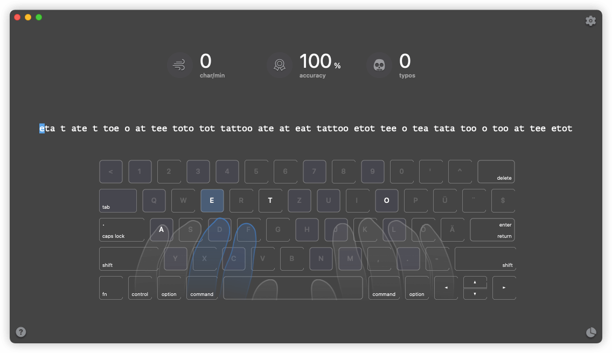
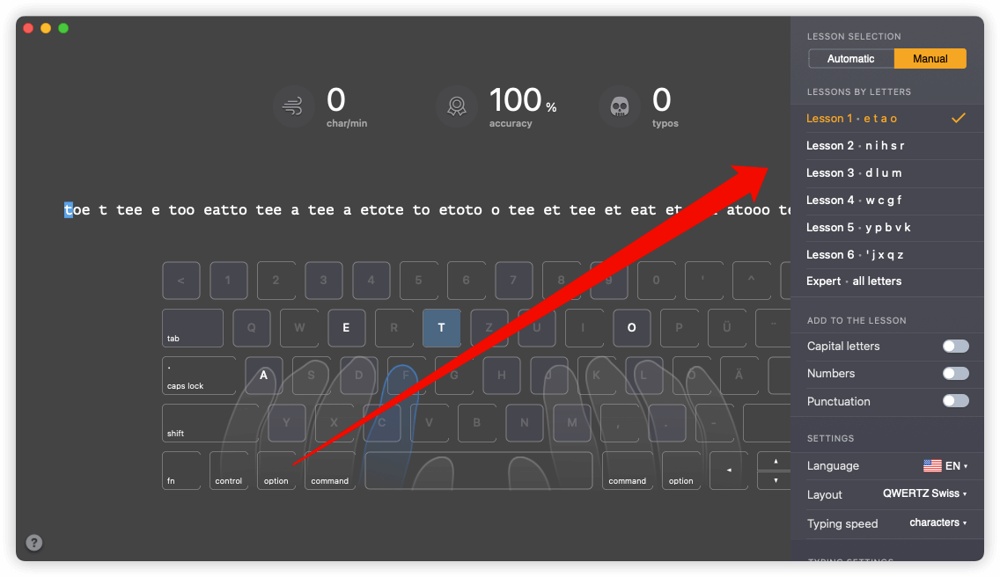

## bb

自从入手了机械键盘，买的是青轴，打字就变得很惬意.由于平时一直在整这整那，而且没有去练，导致打字速度属实有点儿拉胯啦，这不，最近发现了个练打字的软件-`keykey typing tutor`，体验甚好，自从用了它，我的打字速度可以说是翻了一番，简直不要太爽，准备当一回“键盘侠”了....

------

## 正文

很多人用windows练打字可能都是用金山打字通，或者是用网页，但是金山打字通几乎是没有维护了，有些功能还要登陆才能用，设计也很拉胯，体验不是很好，网页就更别提了，网页app有时打开会有点慢，不像app可以随心所欲。今天分享的软件`keykey typing tutor`是macOS下的软件，App Store是收费的，但是作为穷学生的我显然买不起，所以懂得都懂.....

放一张软件的界面截图吧...

软件界面算是比较简洁的，而且也能进行一些自定义设置，通过设置letters和一些复杂难度就可以进行针对性训练，效果很棒

## more

in writing....