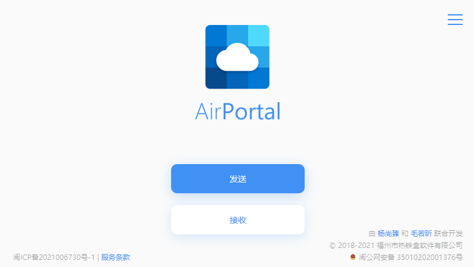

## what's up

貌似互联网上有大部分人觉得文件传输很麻烦，而微信传输只能在多个微信号之间传输，甚至还有大小限制，使用网盘传输又很容易被限速，所以今天就推荐几个好用的免费的文件传输工具。。。。

## MUSE

偶然发现的一个优雅的文件传输网站，体验不错，还支持浏览器扩展,速度是不限速，还能进行一些个性化设置，设计风格我还是很喜欢的

> MUSE官网
>
> https://musetransfer.com/

## FireFox Send

Fire Send似乎是火狐浏览器那家公司推出的一个小工具，火狐应该是可以信的过的，这个小工具可以直接通过web来使用，只需要访问其网站就行

> FireFox Send官网
>
> https://send.ioiox.com/

------

## AirPortal

开发这个工具的作者也开发了一个很火的青柠起始页，此工具同样支持文件分享，也支持文本加密分享

>  AirPortal官网
>
> https://airportal.cn/

------

## 奶牛快传

这个貌似是通过主页广告来盈利的，不过也是不限速的，还挺好用的

> 奶牛快传官网
>
> https://cowtransfer.com/

