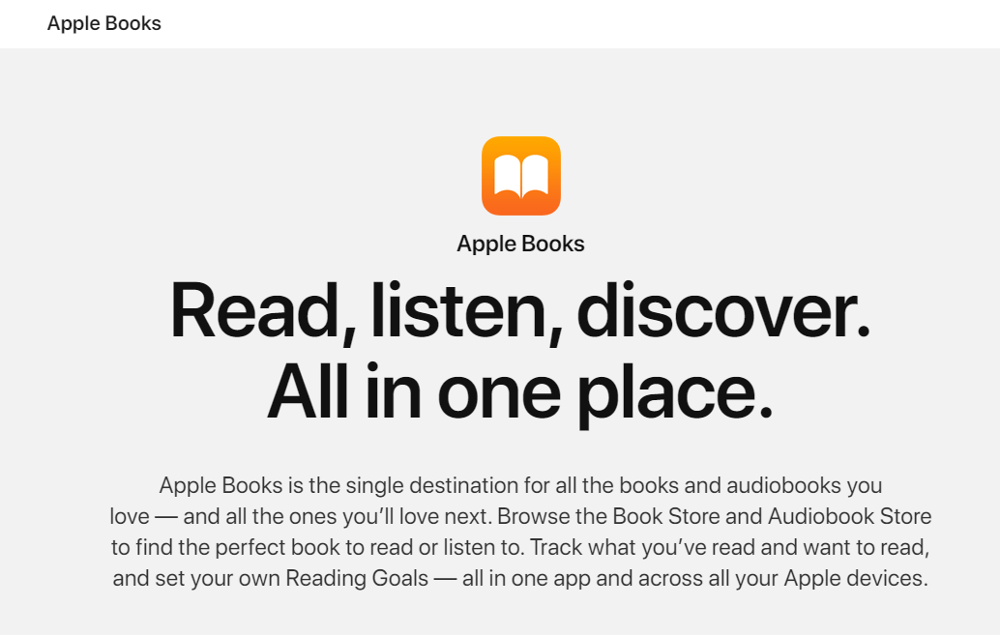
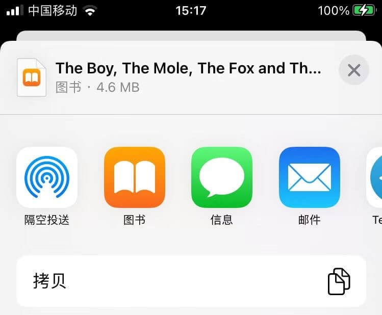
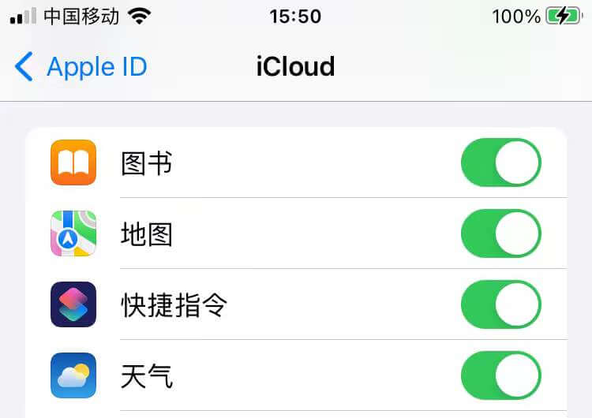
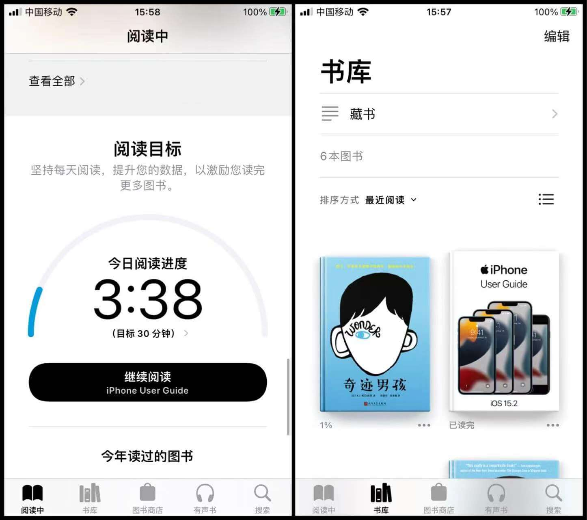

## 🍉一些废话

这是一篇关于一个屑博主想读书后水的一篇文章，并试图拉你一起下水（bushi) 😅.

我会写的尽量详细，但这只是一个我认为可行的一个方案，或许你也可以直接摸索适合你自己的阅读方案。

在b站上面看到了一个up主分享的英文原著阅读，瞬间感觉又行了🤣，恰好iOS系统自带了 `Apple Books`，于是乎新一轮的折腾便开始，害~🤔

## 🎉开始之前

在开始之前，你应该先有所准备，Follow：

| 硬件                        | 软件          |
| ------------------------- | ----------- |
| 装有较新OS的iPhone（或者iPad、Mac) | Apple Books |
| ......                    | 浏览器         |

### 🧀理论知识

> `Apple Books`貌似只支持导入 `epub`格式的电子书.

### 🍥软件获取

> 如果已经安装完apple books了的话就可以跳过了不看了
> 
> 一般一个完整OS都自带apple books，但不排除有人把它删了

从官网获取最新版 `apple books`,几乎每个区域的 `app store`都提供了软件下载，可以直接搜索下载

**官网地址**：[Apple Books on the App Store](https://apps.apple.com/us/app/apple-books/id364709193)

---

## 📄正文

### 🎃核心思想

> 通过获取各种想要的书籍的epub格式并使用apple books打开即可成功导入并使用。

### 📢书籍来源

> 这里我只推荐几个常用的获取电子书的地方，不能保证稳定不掉，如果掉了，你也可以自行Google一些资源

| 电子书资源链接                              | 简介                |
| ------------------------------------ | ----------------- |
| [书舟搜索](https://www.shuzhou.cc/)      | 基本上能满足大部分书籍了      |
| [Z-Library](https://b-ok.xyz/)       | 号称世界最大的电子图书馆      |
| [鸠摩搜索 ](https://www.jiumodiary.com/) | 界面可爱又简洁，提供各种电子书格式 |
| ...                                  | ...               |

> 注：Z-library主站貌似要魔法才能用,这里提供几个Z站“子站点”，资源全部互通，访问没有限制。
> 
> | Z-library子站点                              |
> | ----------------------------------------- |
> | [http://b-ok.com](http://b-ok.com/)       |
> | [https://hk1lib.org](https://hk1lib.org/) |
> | [https://zh.1lib.pl](https://zh.1lib.pl/) |
> | [https://1lib.tw](https://1lib.tw/)       |
> 
> 虽说是国外站点，但适配了中文界面（如果打开是英文，可拉到页面最底部，english那里选chinese），全站无广告，也无强制登录。

#### 进阶:

通过Telegram一些电子书频道能够快速获得想要的epub电子书，当然使用telegram存在一些门槛

---

### 📌使用方法

**通过获取epub格式的电子书，使用你的设备并将需要的书籍导入到 `apple books`**

---

### 🎄同步书籍

**同步你的书籍很方便，只需要在你的iCloud里开启books同步按钮即可**

### 🃏软件的一些界面

这里展示一张软件使用的界面，大概看看就行

### 🔮管理你的图书

简单粗暴，你可以直接在 `apple books`里管理你的书籍

### ✏阅读分享（非必要

这个其实有很多有很多种方法，比如b站有up用notion来搭建，当然也可以使用你的blog来分享，这个可以自行发挥。

## 📕more

In Writing.............
